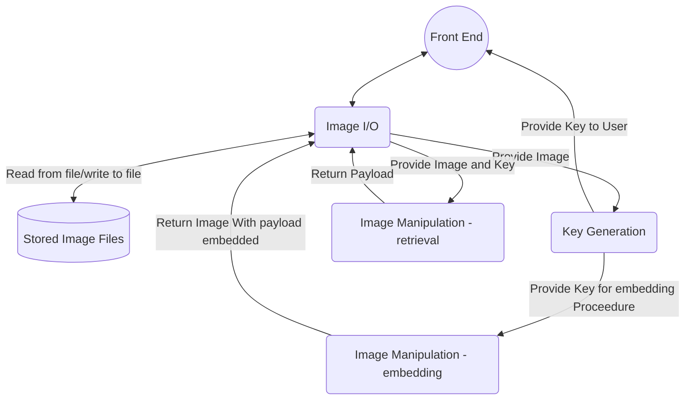

The design document

As with phase 2, there is a substantial amount of work associated with this phase and the choices made will have significant implications for the rest of the project - start early, work carefully, and be sure the whole team is in agreement with the decisions made.

As a general rule, all documents should adhere to high standards of writing quality, including spell checking, grammatical correctness, consistent layouts/formats, appropriate use of footnotes, appendices, glossaries, tables/figures/diagrams, citations, etc.

Before work starts on the implementation (coding), we want to ensure a clean design has been agreed upon by all team members, and that we have documented our design in a single shared resource (the design.md file).

This will be the largest and most fundamental document for this phase of the project, and involves documenting in detail both the logical and physical design of the product.

The document is the one your team (and the instructor and other readers) will be using as a reference point when they need to decide how/what the final product code elements are supposed to be doing/implementing, so needs to be well organized, consistent, and as complete, up to date, and error free as possible. (Your team will be responsible for keeping the document up to date as the project progresses and you refine your ideas on the product design.)

The actual format of the document is left largely to the team's discretion, but discussion of the expected content is provided below, and the lecture material covers a variety of ideas and approaches to design modeling.

However the document is actually structured/ordered, the following information (at a minimum) needs to be present:

A design overview
    This provides an intuitive overview of the high level logical design, preferably with a context diagram (the top level DFD), and also of the key transformations/decisions that will be needed when going from the logical design to an implementation.

A medium-sized project might involve dividing the overall system into several interacting subsystems, dividing each subsystem into several interacting modules, dividing each module into a number of interacting components, etc.

Since different subsystems/modules/components will likely be developed by different people, it is important that as a team we clearly establish the responsibilities of each element and how they will interact with others. Thus for each level of decomposition I generally recommend the inclusion of a data flow diagram (DFD), with clear supporting explanation.

Each element of the system (i.e. each subsystem, module, component, etc) should contain clear, easily referenced descriptions of:
        its overall purpose
        each of the services it provides for other elements of the same DFD level (what will it implement that is used by other portions of the system?)
        - this should show the information exchanged during that process
        the interactions between it and the user(s) and any other external systems
        any persistent data it will need to store, giving each data component a name and identifying the type and restrictions on the data (e.g. "vehicle weight will be stored as a non-negative real number of kilos, rounded to the nearest kilo) 

As discussed in lectures, we are seeking a division into elements that are cohesive yet loosely coupled, and we want to ensure that all aspects of the overall product functionality are captured somewhere within our design.

The transition from the logical design to an implementation
    Eventually we'll need to map the elements of our logical design to actual codable entities.

This section isn't expected to be rigorously completed for phase 3, but the goal is to have an organized start/outline (something we can build off of in phase 4 to get implementation underway).

Key elements to consider include:
        identifying the programming language(s) and any supporting tools to be used
        identifying the directory and file naming structure to be used within the code repository: identifying the files/directories/subdirectories we use to store the different actual code elements
        identifying the implementation method for each shared data store (database, file, etc), including format, fields, layout
identifying the interface for all public services provided by the element:
- publicly accessible/shared data types and fixed/constant values
- publicly callable routines, what they return, what they'll expect as parameters
- classes/objects to be used, their key public fields and methods
This gets close to the level of code skeletons, but does not yet need to be expressed as actual code in the target language(s). 

A glossary: This is optional but often nice to have: if a term is specific to the product or is unlikely to be known by the average reader (e.g. a random second year CS student) then include an entry for it.

Any appendices (if/as needed) 

Note that all elements of all figures/diagrams should be clearly described/referenced in the associated text. 
[SAMPLE DOCUMENT LINK](http://csci.viu.ca/~wesselsd/courses/csci265/project/sample_docs/logicaldesign.pdf)

==================================================================
DELETE ALL ABOVE HERE

# CSCI 265 Logical Design (Phase 3)

## Team name: Project HiddenFrame

## Project/product name: HiddenFrame

## Contact person and email
The following person has been designated the main contact person for questions from the reader:

 - Patrick Candy candy.pat@gmail.com

Alternate contact person:

 - Jeremy Shumuk admin@payrollinsights.ca
# Table of Contents
 1. [Known Omissions](#1-known-omissions)
 2. [Design Overview](#2-design-overview)
 3. [Logical Design]
 4. [Front-End Design](#3-front-end-design)
    - 3.1. [Public Aspect](#31-public-aspect)
    - 3.2. [Private Aspect](#32-private-aspect)
 5. [Back-End Design](#4-back-end-design)
    - 4.1. [Image I/O](#41-image-i/o)
    - 4.2. [Key Generation](#42-key-generation)
    - 4.3. [Payload Embedding/Retrieval](#43-payload-embedding/retrieval)
 6. [Network Design](#5-network-design)
 7. [Data Design](#6-data-design)
 8. [Other Design Elements](#7-other-design-elements)
    - 7.1. [Project Directory Structure](#71-project-directory-structure) 
 9. [Glossary](#8-glossary)
 10. [Appendixes](#9-appendixes)

# List of Figures

## 1. Known Omissions
- Network module is not in logical design diagram

## 2. Design Overview

## 3. Logical Design 
HiddenFrame will require several components to function correctly. The main overall components are:
1. User Environment module
2. User Account module 
3. Network module
4. Imaging module
Notably the User Environment module and Imaging module will be required to handle different input steams for different types of users. A further decomposition of each of these modules is provided in their own sections.

Below is a sequence diagram describing the anticipated flow of data for HiddenFrame (note: Network Module is excluded as it primarily acts as a relay/facilitator of all of these transactions). 
~~~mermaid
---
Title:Design Overview
---
sequenceDiagram
    participant public as Public User
    participant private as Private User
    participant main as User Environment Module
    participant account as User Account Module
    participant image as Imaging Module
    participant db as Filesystem

    Note over private,db: The user must be logged in to use steganography
    private->>+account: Logs in using credentials
    account->>db: Query stored accounts
    db->>account: Respond with query result

    alt Credentials not found
        account->>private: Invalid credentials
    else Credentials found
        account->>-private: Successfully logged in
        Note over private,db: When the user is authenticated, they can now use steganography
        public->>main: View picture
        main->>image: Retrieve image
        image->>db: Read image data
        db->>image: Image data
        image->>main: Image
        main->>public: Image
        private->>main: View pictures
        main->>image: Retrieve image
        image->>db: Read image data
        db->>image: Image data
        image->>main: Image
        main->>private: Image
        public->>main: Upload picture
        main->>image: Store image
        image->>db: Write image to filesystem
        image->>main: Store successful
        main->>public: Upload successful
        par Payload Embedding
            private--)main: upload picture & payload
            private--)main: Embed Image with payload
            main--)image: Encode Image with payload
            image--)db: Store modified image
        and Response
	        image-->>main: Image Embeded and stored
            main-->>private: Successfully embedded
        end
        par Payload Retrieval
            private--)main: View picture with payload
            private--)main: Upload key
            main--)image: Retrieve modified image
            image--)db: Read modified image
        and Response
	        db-->>image: Image data
	        image-->>main: Image read and decoded
            main-->>private: payload
        end
    end
~~~
## 4. Front-End Design
### 4.1. Public Aspect
### 4.2. Private Aspect

## 5. Back-End Design
 The back end of HiddenFrame will have to deal with 4 general requests from the front end system. 
 1. Public/Private Aspect user Requests Image Storage (no steganography req)
 2. Private Aspect user requests Image Storage (Steganography req)
 3. Public/Private Aspect user requests an stored image that has no payload or has a key that does not match.
 4. Private Aspect user requests an stored image with a payload and has the key
 Overview of back end design modules and data flow is as follows

### 5.1. Image I/O
The Image I/O module will be responsible for handling any requests to store or retrieve images from the server's file system. In order to perform these operations HiddenFrame will utilize two small prebuilt libraries of C functions: stb_image.h and stb_image_write.h. Using these two libraries We will be able to read and write images to file.

Since the manipulation of images is a key component of HiddenFrame's functionality, for ease of manipulation we will create two an class called "image." The Image class will contain methods for all other components of the Image subsystem. The following is a class definition for HiddenFrame's Image class.
~~~mermaid
classDiagram
class image{
    +image();
    +image(string filepath);
    +~image();
    +int width;
    +int height;
    +int channels;
    +string filetype;
    +void displayImageProperties();
    +void modify_image(int n, int arr[], int arrSize);
    +string retrieve_payload(int n);
    +void write_image(string filename);
    -void load_image(string filepath);
    -unsigned char* original_image;
    -unsigned char* modified_image;
}
~~~
There are two methods in "image" which are used in image I/O and they will lean heavily on two prebuilt libraries, the stb_image.h and stb_image_write to achieve functionality. These libraries greatly simplify the process of reading and writing images to file, allowing  our project to focus on the steganographic process. 
### 5.2. Key Generation
 
### 5.3. Payload Embedding/Retrieval
#### Embedding:
After a suitable key is generated for the target image, we then need to encode the payload. To employ this we will utilize the "image" class's modify_image method to perform the embedding procedure. Beforehand we convert the payload to a binary string, and then into a specialized array; the odd entries of this array represent the number of contiguous symbols in the subsequent array entry (which will be a 1 or 0). The maximum number that the odd entries can contain is the number of channels in the image eg: for a 3 channel image {3,1,2,0,3,1,1,0} would represent the binary string 111001110. We then perform bitwise operations on the LSB of each pixel's character. To encode a series of 3 ones we set the LSB of the 3rd channel (blue) to a 1 and the other two channels LSB's to a 0. Conversely if we wish to encode 3 0's we would set the 3rd channel's LSB to a 0, and the other two channels LSB's to a 1. The following example would encode a binary 11:

We utilize the generated key to provide separation between the pixels we encode and since we only modify the shade of the pixel very slightly it does not appear out of place when the image is viewed. 

It is important to note here that we cannot store images as the .JPG file type, as this type of image file is lossy; the use of compression eradicates the subtle changes made to the image and render the payload irretrievable. 
### Retrieval:
Here we utilize the "Image" class's retrieve_payload method. This portion works very similar to the embedding process in reverse; we utilize the provided key to visit pixels that are encoded, retrieve the binary values concatenating a string that we return as the binary of the original payload. 

## 6. Network Design

## 7. Data Design

## 8. Other Design Elements
### 8.1 Project Directory Structure
A few guidelines for Project HiddenFrame's Directory structure are laid out in the standards document. Beyond what is listed there we will utilize the following structure (note documentation is included in the FS but no other files are):
~~~mermaid
---
Title: Project Directory Structure
---
graph LR

    root[.] --> 1[README.md]
    root --> 2[documentation]
    root --> 3[resources]
    root --> 4[apps]
    subgraph 4g[All project applications.]
      4 --> 41[backend]
      4 --> 42[web]
    end
    subgraph 41g[All project backend-programs.]
      41 --> 411[include]
      41 --> 412[src]
    end
    subgraph 42g[All project frontend-programs.]
      42 --> 421[src]
    end
    subgraph 3g[All project resources.]
	  3 --> 31[images]	 
    end
    subgraph 31g[All project Images.]
	  31 --> 311[test]				  	 
    end
    subgraph 312g[All project Test Images]
	  311 --> 3111[input]
	  311 --> 3112[output]	 
    end
    subgraph 2g[All project documents.]
      2 --> 21[charter.md]
      2 --> 22[design.md]
      2 --> 23[proposal.md]
      2 --> 24[requirements.md]
      2 --> 25[standards.md]
      2 --> 26[update.md]
    end
    subgraph 1g[The project overview.]
      1
    end
~~~
## 9. Glossary

**LSB** - Least significant bit

## 10. Appendixes
