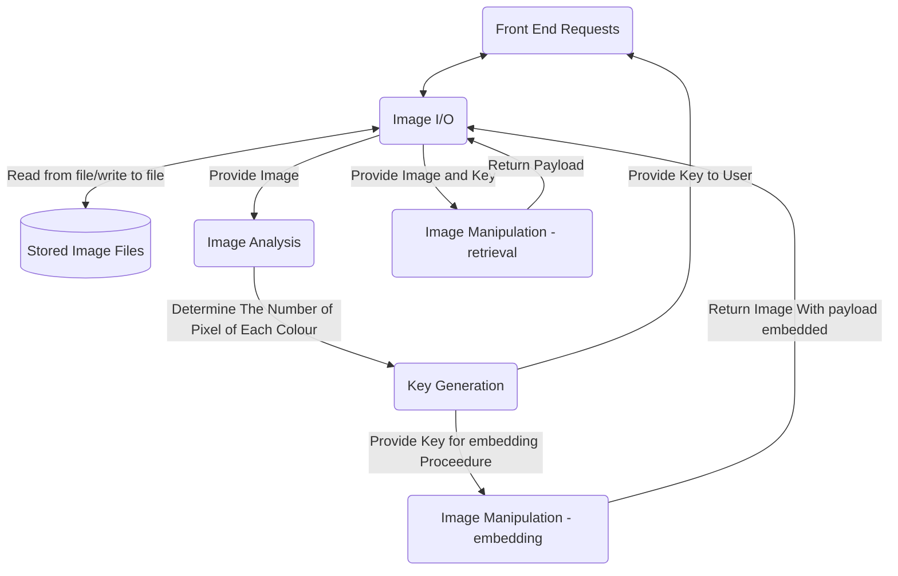

The design document

As with phase 2, there is a substantial amount of work associated with this phase and the choices made will have significant implications for the rest of the project - start early, work carefully, and be sure the whole team is in agreement with the decisions made.

As a general rule, all documents should adhere to high standards of writing quality, including spell checking, grammatical correctness, consistent layouts/formats, appropriate use of footnotes, appendices, glossaries, tables/figures/diagrams, citations, etc.

Before work starts on the implementation (coding), we want to ensure a clean design has been agreed upon by all team members, and that we have documented our design in a single shared resource (the design.md file).

This will be the largest and most fundamental document for this phase of the project, and involves documenting in detail both the logical and physical design of the product.

The document is the one your team (and the instructor and other readers) will be using as a reference point when they need to decide how/what the final product code elements are supposed to be doing/implementing, so needs to be well organized, consistent, and as complete, up to date, and error free as possible. (Your team will be responsible for keeping the document up to date as the project progresses and you refine your ideas on the product design.)

The actual format of the document is left largely to the team's discretion, but discussion of the expected content is provided below, and the lecture material covers a variety of ideas and approaches to design modeling.

However the document is actually structured/ordered, the following information (at a minimum) needs to be present:

The team and project name, contact info (the contact info is just a single point of contact in case a reader has questions or feedback)

A table of contents (optional but nice to have)

    A design overview
    This provides an intuitive overview of the high level logical design, preferably with a context diagram (the top level DFD), and also of the key transformations/decisions that will be needed when going from the logical design to an implementation.

    The logical design
    In the logical design we need to specify the decomposition of our system into smaller components from a logical (code-independent) perspective. The logical design should reflect either a layered/top-down approach or an object-oriented approach (or a hybrid of the two), clearly describing the division of the overall system into key components, then clearly describing the decomposition of those, etc. as needed.

    A medium-sized project might involve dividing the overall system into several interacting subsystems, dividing each subsystem into several interacting modules, dividing each module into a number of interacting components, etc.

    Since different subsystems/modules/components will likely be developed by different people, it is important that as a team we clearly establish the responsibilities of each element and how they will interact with others. Thus for each level of decomposition I generally recommend the inclusion of a data flow diagram (DFD), with clear supporting explanation.

    Each element of the system (i.e. each subsystem, module, component, etc) should contain clear, easily referenced descriptions of:
        its overall purpose
        each of the services it provides for other elements of the same DFD level (what will it implement that is used by other portions of the system?)
        - this should show the information exchanged during that process
        the interactions between it and the user(s) and any other external systems
        any persistent data it will need to store, giving each data component a name and identifying the type and restrictions on the data (e.g. "vehicle weight will be stored as a non-negative real number of kilos, rounded to the nearest kilo) 

    As discussed in lectures, we are seeking a division into elements that are cohesive yet loosely coupled, and we want to ensure that all aspects of the overall product functionality are captured somewhere within our design.

    The transition from the logical design to an implementation
    Eventually we'll need to map the elements of our logical design to actual codable entities.

    This section isn't expected to be rigorously completed for phase 3, but the goal is to have an organized start/outline (something we can build off of in phase 4 to get implementation underway).

    Key elements to consider include:
        identifying the programming language(s) and any supporting tools to be used
        identifying the directory and file naming structure to be used within the code repository: identifying the files/directories/subdirectories we use to store the different actual code elements
        identifying the implementation method for each shared data store (database, file, etc), including format, fields, layout
identifying the interface for all public services provided by the element:
- publicly accessible/shared data types and fixed/constant values
- publicly callable routines, what they return, what they'll expect as parameters
- classes/objects to be used, their key public fields and methods
This gets close to the level of code skeletons, but does not yet need to be expressed as actual code in the target language(s). 

A glossary: This is optional but often nice to have: if a term is specific to the product or is unlikely to be known by the average reader (e.g. a random second year CS student) then include an entry for it.

Any appendices (if/as needed) 

Note that all elements of all figures/diagrams should be clearly described/referenced in the associated text. 
[SAMPLE DOCUMENT LINK](http://csci.viu.ca/~wesselsd/courses/csci265/project/sample_docs/logicaldesign.pdf)

==================================================================
DELETE ALL ABOVE HERE

# CSCI 265 Logical Design (Phase 3)

## Team name: Project HiddenFrame

## Project/product name: HiddenFrame

## Contact person and email
The following person has been designated the main contact person for questions from the reader:

 - Patrick Candy candy.pat@gmail.com

Alternate contact person:

 - Jeremy Shumuk admin@payrollinsights.ca

# Table of Contents
 1. [Known Omissions](#1-known-omissions)
 2. [Design Overview](#2-design-overview)
 3. [Front-End Design](#3-front-end-design)
    - 3.1. [Public Aspect](#31-public-aspect)
    - 3.2. [Private Aspect](#32-private-aspect)
 4. [Back-End Design](#4-back-end-design)
    - 4.1. [Image I/O](#41-image-i/o)
    - 4.2. [Image Analysis](#42-image-analysis)
    - 4.3. [Key Generation](#43-key-generation)
    - 4.4. [Payload Embedding](#44-payload-embedding)
    - 4.5. [Payload Retrieval](#45-payload-retrieval)
 5. [Network Design](#5-network-design)
 6. [Data Design](#6-data-design)
 7. [Other Design Elements](#7-other-design-elements)
    - 7.1. [Project Directory Structure](#71-project-directory-structure) 
 8. [Glossary](#8-glossary)
 9. [Appendixes](#9-appendixes)

# List of Figures

## 1. Known Omissions

## 2. Design Overview

## 3. Front-End Design
### 3.1. Public Aspect
### 3.2. Private Aspect

## 4. Back-End Design
 The back end of HiddenFrame will have to deal with 4 general requests from the front end system. 
 1. Public/Private Aspect user Requests Image Storage (no steganography req)
 2. Private Aspect user requests Image Storage (Steganography req)
 3. Public/Private Aspect user requests an stored image that has no payload or has a key that does not match.
 4. Private Aspect user requests an stored image with a payload and has the key
 Overview of back end design modules and data flow is as follows

### 4.1. Image I/O
The Image I/O module will be responsible for handling any requests to store or retrieve images from the server's file system. In order to perform these operations HiddenFrame will utilize two small prebuilt libraries of C functions: stb_image.h and stb_image_write.h. Using these two libraries We will be able to read and write images to file.

Since the manipulation of images is a key component of HiddenFrame's functionality, for ease of manipulation we will create two types of objects; images and pixels.

**Pixels** will be structs. The main purpose of the pixel structs will be to simply operations such as image analysis and manipulation. The equivalence operator for a pixel will be overloaded thus simplifying comparisons. 

~~~mermaid
classDiagram
class pixel{
    unsigned char red;

    unsigned char green;

    unsigned char blue;

    unsigned char alpha;

    unsigned long int count=1;

    bool operator == (const pixel& rhs) const;

}
~~~

**Image** objects will be a class, The Image class will contain methods for all other components of the Image subsystem. After using the stb library to load the target image from the file system as a unsigned char array, HiddenFrame will generate an array of Pixel objects from this image for manipulation. 
~~~mermaid
classDiagram
class image{
    +image();
    +image(string filepath);
    +~image();
    +int width;
    +int height;
    +int channels;
    +pixel* pArr;
    +string filetype;
    +displayImageProperties() void;
    +image_analysis(pixel*) void;
    -pixel_array() void;
    -load_image(string filepath) void;
    -combined_hash(unsigned char r, unsigned char g, unsigned char b, unsigned char alpha) size_t;
    -unsigned char* original_image;
}
~~~
### 4.2. Image Analysis
Image Analysis by HiddenFrame will leverage the Image class of the Image I/O system.  be performed inserting all of the Pixels present in the array of Pixels into an unordered map. In order to do so the Image class has access to a a function that can produce a hash value based on the four possible channels of a input image. 

When a collision occurs, this indicates that the Pixel Objects had the same component values, and thus increases the count of that Pixels color by 1. The result will be a unordered map that contains one pixel object per color in the original image, with the pixels count field displaying the number of times the pixel appears in the image.
### 4.3. Key Generation
 
### 4.4. Payload Embedding
### 4.5. Payload Retrieval 

## 5. Network Design

## 6. Data Design

## 7. Other Design Elements
### 7.1 Project Directory Structure
A few guidelines for Project HiddenFrame's Directory structure are laid out in the standards document. 

## 8. Glossary

## 9. Appendixes
