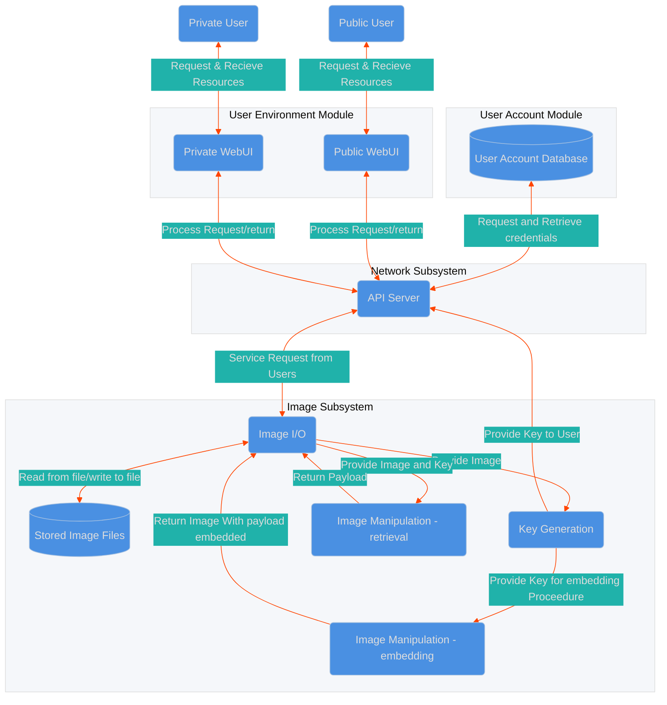
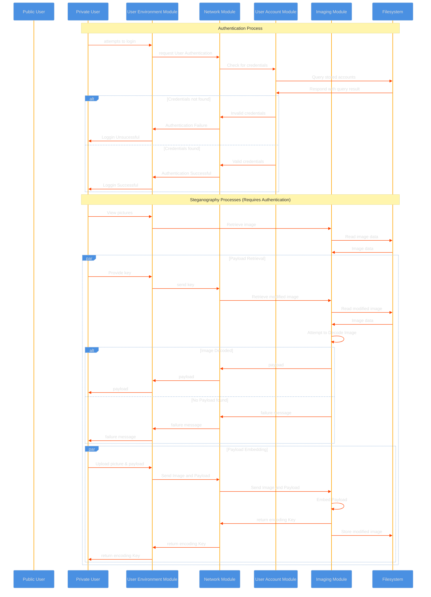
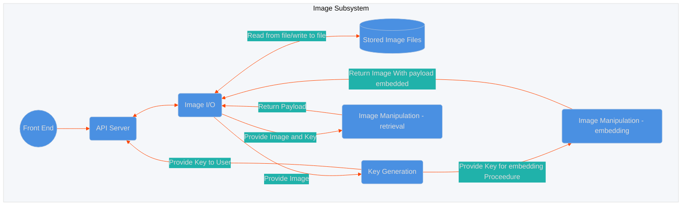
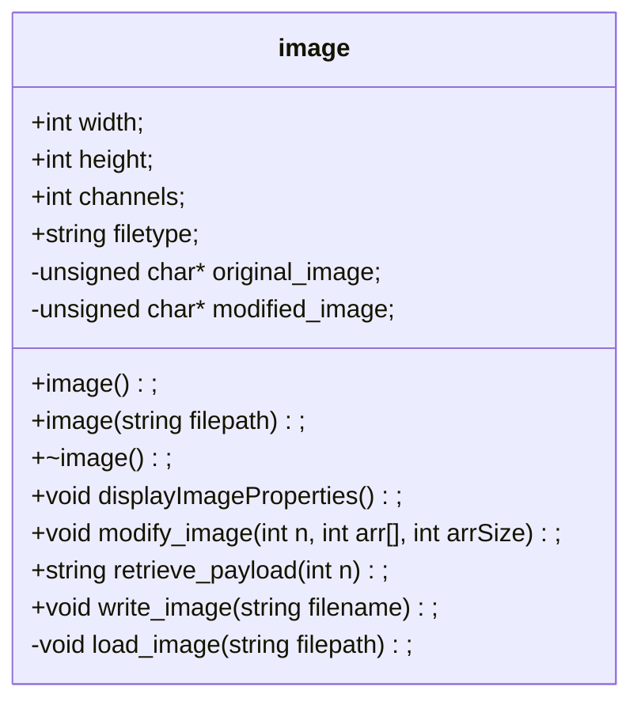
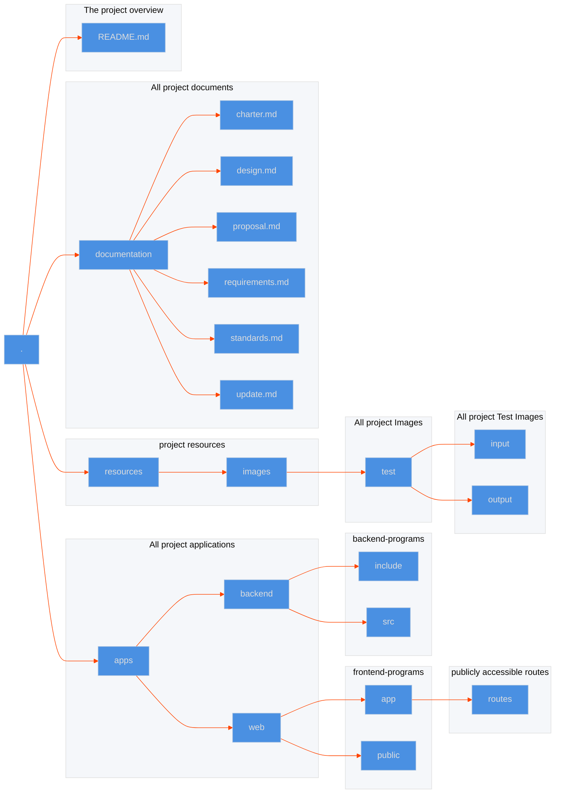

# CSCI 265 Logical Design (Phase 3)

## Team name: Project HiddenFrame

## Project/product name: HiddenFrame

## Contact person and email

The following person has been designated the main contact person for questions from the reader:

- Patrick Candy candy.pat@gmail.com

Alternate contact person:

- Jeremy Shumuk admin@payrollinsights.ca

# Table of Contents

1.  [Known Omissions](#1-known-omissions)
2.  [Design Overview](#2-design-overview)
3.  [Logical Design](#3-logical-design)
4.  [Front-End Design](#4-front-end-design)
    - 4.1. [Front-End Configuration](#42-font-end-configuration)
    - 4.2. [Public Aspect](#41-public-aspect)
    - 4.3. [Private Aspect](#42-private-aspect)
    - 4.3.1. [Image Wall](#431-image-wall)
5.  [Back-End Design](#5-back-end-design)
    - 5.1. [Image I/O](#51-image-i/o)
    - 5.2. [Key Generation](#52-key-generation)
    - 5.3. [Payload Embedding/Retrieval](#53-payload-embedding/retrieval)
6.  [Network Design](#6-network-design)
7.  [User Account Design](#7-user-account-design)
8.  [Other Design Elements](#8-other-design-elements)
    - 8.1. [Project Directory Structure](#81-project-directory-structure)
9.  [Glossary](#9-glossary)
10. [Appendixes](#10-appendixes)

# List of Figures

## 1. Known Omissions
No sections currently discuss user account creation process
## 2. Design Overview
The following is a Top Level Data Flow Diagram that describes the overall design of HiddenFrame

## 3. Logical Design 
HiddenFrame will require several components to function correctly. The main overall components are:

1. User Environment module
2. User Account module
3. Network module
4. Imaging module
Notably the User Environment module and Imaging module will be required to handle different input steams for different types of users. A further decomposition of each of these modules is provided in their own sections.
Below is a sequence diagram describing the anticipated flow of data for HiddenFrame (note: Network Module is excluded as it primarily acts as a relay/facilitator of all of these transactions).

### 4.1 Front-End Configuration

- Node and NPM: For developement we are using node.js and node package manager, since our framework Remix is built on the Web fetch API we will not need to use node.js in production.
- Typescript: TypeScript is used to ensure strict type-checking and cleaner code, especially when handling sensitive functionality like steganographic embedding and decryption.
- Remix: We are using Remix as our frontend framework. Remix is a brand new framework that optimizes performance, simplifies full-stack React development, and efficiently manages data with built-in support for modern web standards and tools. It helps us to focus on the user interface and work back through web standards to create a fast and stable user experience.
- Vite: Vite is the default build tool for Remix, providing fast development server capabilities and optimized builds, which are important for maintaining the security of the private communication features.
- TailwindCSS: TailwindCSS is being in our project to build responsive layouts for the image grid and other UI elements. We have customized the config file to add our brand colors.
- ESLint: We are using ESLint to enforce clean coding practices to maintain a consistent and error-free codebase for the public-facing UI.

### 4.2. Public Aspect

The public-facing part of the website serves as a picture-sharing platform, allowing users to upload and browse images. This aspect is crucial to attracting a broad user base and providing the platform's visual appeal.

- Main Features:
  - Image Wall: A grid of publicly shared images that scrolls infinitely.
  - Image Upload: A button at the top allows users to upload images to the platform. These images will appear on the public wall after uploading.
  - User Interactions(stretch goal): Users can like, comment on, and share images.
- User Experience:
  - The image wall is designed for ease of use, with images displayed in a 3x3 grid format. Hover effects and clickable icons provide an intuitive interaction model for public users.
  - Responsive Design: The public aspect will be optimized for desktop, with some mobile functionality being a stretch goal.

### 4.3. Private Aspect

The private side of HiddenFrame is accessible only to privileged users who have login credentials. This aspect enables secure communication through hidden messages embedded in images using steganography.

- Main Features:

  - Private Login Page: A dedicated login page for users with access to the hidden messaging system.
  - Secret Message Board: After logging in, users can upload images with hidden messages and decode messages from received images.
  - Invite System: Privileged users can invite others to access the private aspect, creating a controlled environment for hidden communication.

- Security and Privacy:
  - Login Protection: The private login page will be built with security in mind, using HTTPS and appropriate authentication measures.

#### 4.3.1. Image Wall

Image Wall is a grid of publicly shared images that scrolls infinitely. It is designed for ease of use, with images displayed in a 3x3 grid format. Hover effects and clickable icons provide an intuitive interaction model for public users. The image wall uses CSS grid classes to ensure responsivness. Tha data for it is fetched from the back-end API server on page load. Each image is a 16 REM by 16 REM square with 0.5 REM rounded corners. Each image is encapsulated in the anchor tag, which, onve clicked, opens the image in a new tab. The images are shown in order of ascending based on time of creation.

## 5. Back-End Design

The back end of HiddenFrame will have to deal with 4 general requests from the front end system.

1.  Public/Private Aspect user Requests Image Storage (no steganography req)
2.  Private Aspect user requests Image Storage (Steganography req)
3.  Public/Private Aspect user requests an stored image that has no payload or has a key that does not match.
4.  Private Aspect user requests an stored image with a payload and has the key
    Overview of back end design modules and data flow is as follows

### 5.1. Image I/O
The Image I/O module will be responsible for handling any requests to store or retrieve images from the server's file system. In order to perform these operations HiddenFrame will utilize two small prebuilt libraries of C functions: stb_image.h and stb_image_write.h. Using these two libraries We will be able to read and write images to file. 
Since the manipulation of images is a key component of HiddenFrame's functionality, for ease of manipulation we will create a class called "image." The Image class will contain methods for all other components of the Image subsystem. The following is a class definition for HiddenFrame's Image class.

There are two methods in "image" which are used in image I/O and they will lean heavily on two prebuilt libraries, the stb_image.h and stb_image_write to achieve functionality. These libraries greatly simplify the process of reading and writing images to file, allowing our project to focus on the steganographic process.

### 5.2. Key Generation

### 5.3. Payload Embedding/Retrieval

#### Embedding:

After a suitable key is generated for the target image, we then need to encode the payload. To employ this we will utilize the "image" class's modify_image method to perform the embedding procedure. Beforehand we convert the payload to a binary string, and then into a specialized array; the odd entries of this array represent the number of contiguous symbols in the subsequent array entry (which will be a 1 or 0). The maximum number that the odd entries can contain is the number of channels in the image eg: for a 3 channel image {3,1,2,0,3,1,1,0} would represent the binary string 111001110. We then perform bitwise operations on the LSB of each pixel's character. To encode a series of 3 ones we set the LSB of the 3rd channel (blue) to a 1 and the other two channels LSB's to a 0. Conversely if we wish to encode 3 0's we would set the 3rd channel's LSB to a 0, and the other two channels LSB's to a 1. The following example would encode a binary 11:

We utilize the generated key to provide separation between the pixels we encode and since we only modify the shade of the pixel very slightly it does not appear out of place when the image is viewed.

It is important to note here that we cannot store images as the .JPG file type, as this type of image file is lossy; the use of compression eradicates the subtle changes made to the image and render the payload irretrievable.

### Retrieval:

Here we utilize the "Image" class's retrieve_payload method. This portion works very similar to the embedding process in reverse; we utilize the provided key to visit pixels that are encoded, retrieve the binary values concatenating a string that we return as the binary of the original payload.

## 6. Network Design
Since our system is written in C++ in its back-end and uses a Javascript framework in its front-end, our front-end to back-end communication will be utilizing an API server made using ["Crow"](https://crowcpp.org/) which is a C++ framework for creating HTTP or websocket Web services. It will be useful for our system for its built-in JSON support and to make back-end to front-end communication seamless. 

We will be implementing Crow in the back-end and defining routes to handle HTTP GET and POST requests for sending and receiving data to and from the front-end.

GET requests to:

- Retrieve private message from the Secret Chat Page
  - Response: A JSON object containing the private messages.
- Retreive number of remining allowed invites for current privileged user.
  - Response: A JSON object containing the remaining invite count.
- Retrieve error messages for situations like: invalid credentials, invalid image format, exceeding allowable length(1024 UTF-8 characters) for a hidden message, etc. 
  - Response: A JSON object containing the error message.
- Retrieve system generated keys that decode the embedded images.
  - Response: A JSON object containing the keys for the embedded images.
- Retrieve embedded images with a hidden message.
  - Response: An image file or url.  
- Retrieve decoded image embedded image after key has been recognized(stretch goal).
  - Response: An image file or url.
- Retrieve decoded embedded image after key has been recognized.
  - Response: An image file or url.
- Retreive the amount of likes on a specific image(stretch goal).
  - Response: A JSON object containing the like count of the specific image.
- Retrieve image embedded image(stretch goal).
  - Response: An image file or url.

POST requests for:

- Receiving user inputted infromation for the sign up page(email and password).
  - Response: A JSON object confirming success or failure.
- Receiving user inputted credentials for the login page(email and password).
  - Response: A JSON object confirming success or failure.
- Receiving user uploaded images to be uploaded to the image board and/or images to be embedded with a hidden message.
  - Response: A JSON object confirming that the image was uploaded successfully or returning an error if the upload failed.
- Receiving user inputted hidden message to be embedded in the image.
  - Response: A JSON object confirming that the hidden message was successfully embedded in the image or returning an error if the process failed.
- Receiving user inputted private messages being sent through the Secret Chat page.
  - Response: A JSON object confirming the private message has been sent or if the process had failed.
- Receiving the action of the user liking an image(stretch goal).
  - Response: A JSON object confirming the "like" has been received or if an error occured.
- Receiving user uploaded images to be embeded as an image(stretch goal).
  - Response: A JSON object confirming that the image was uploaded successfully or returning an error if the upload failed.

Our front-end utilizes the "Remix" framework where we will leverage the web "fetch API" to handle fetching data from both the client side and the server side.  

Since our system is written in C++ in its back-end and uses a Javascript framework in its front-end, our front-end to back-end communication will be utilizing an API server made using ["Crow"](https://crowcpp.org/) which is a C++ framework for creating HTTP or websocket Web services. It will be useful for our system for its built-in JSON support and to make back-end to front-end communication seamless.

We will be implementing Crow in the back-end and defining routes to handle HTTP GET and POST requests for sending and receiving data to and from the front-end.

GET requests to:

- Retrieve private message from the Secret Chat Page
  - Response: A JSON object containing the private messages.
- Retreive number of remining allowed invites for current privileged user.
  - Response: A JSON object containing the remaining invite count.
- Retrieve error messages for situations like: invalid credentials, invalid image format, exceeding allowable length(1024 UTF-8 characters) for a hidden message, etc.
  - Response: A JSON object containing the error message.
- Retrieve system generated keys that decode the embedded images.
  - Response: A JSON object containing the keys for the embedded images.
- Retrieve embedded images with a hidden message.
  - Response: An image file or url.
- Retrieve decoded image embedded image after key has been recognized(stretch goal).
  - Response: An image file or url.
- Retrieve decoded embedded image after key has been recognized.
  - Response: An image file or url.
- Retreive the amount of likes on a specific image(stretch goal).
  - Response: A JSON object containing the like count of the specific image.
- Retrieve image embedded image(stretch goal).
  - Response: An image file or url.

POST requests for:

- Receiving user inputted infromation for the sign up page(email and password).
  - Response: A JSON object confirming success or failure.
- Receiving user inputted credentials for the login page(email and password).
  - Response: A JSON object confirming success or failure.
- Receiving user uploaded images to be uploaded to the image board and/or images to be embedded with a hidden message.
  - Response: A JSON object confirming that the image was uploaded successfully or returning an error if the upload failed.
- Receiving user inputted hidden message to be embedded in the image.
  - Response: A JSON object confirming that the hidden message was successfully embedded in the image or returning an error if the process failed.
- Receiving user inputted private messages being sent through the Secret Chat page.
  - Response: A JSON object confirming the private message has been sent or if the process had failed.
- Receiving the action of the user liking an image(stretch goal).
  - Response: A JSON object confirming the "like" has been received or if an error occured.
- Receiving user uploaded images to be embeded as an image(stretch goal).
  - Response: A JSON object confirming that the image was uploaded successfully or returning an error if the upload failed.

Our front-end utilizes the "Remix" framework where we will leverage the web "fetch API" to handle fetching data from both the client side and the server side.

## 7. User Account Design
We will utilize a database to store user account information and hashed passwords. This will be a very simple subsystem it is only required to respond to a few types of system requests. When a user attempts to login, username and passwords will be passed through the frontend via our API server to the database. The database will then query it's entries and check if the provided password matches then username. The database will then return the result to the API Server. 

The API server will be responsible for ensuring that users requesting access to resources are only able to access resources for which they have permissions. This will likely be implemented by a token exchange. 
## 8. Other Design Elements

### 8.1 Project Directory Structure

A few guidelines for Project HiddenFrame's Directory structure are laid out in the standards document. Beyond what is listed there we will utilize the following structure (note documentation is included in the FS but no other files are):

## 9. Glossary

**LSB** - Least significant bit
**DFD** - Data Flow Diagram

## 10. Appendixes
