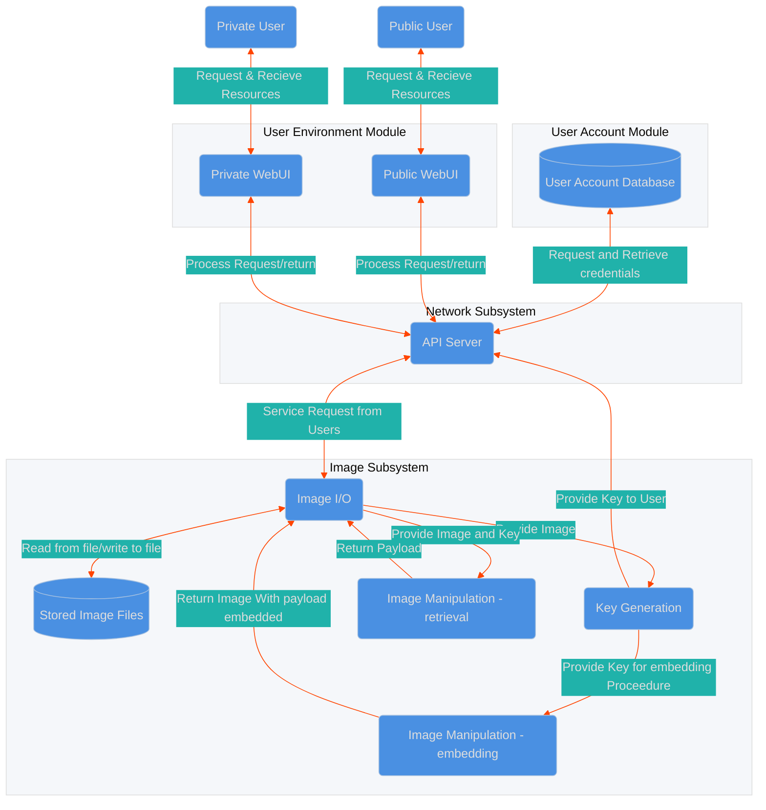
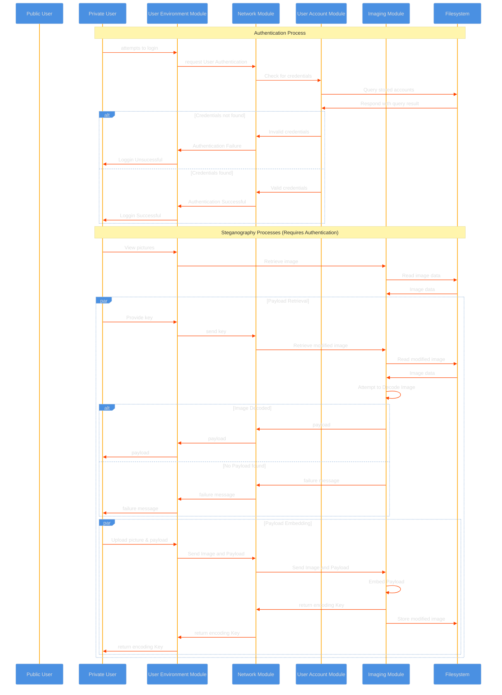
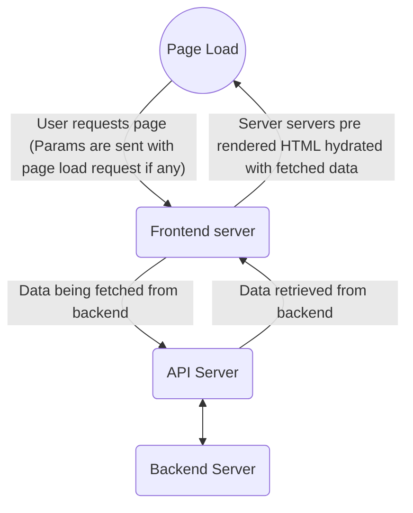
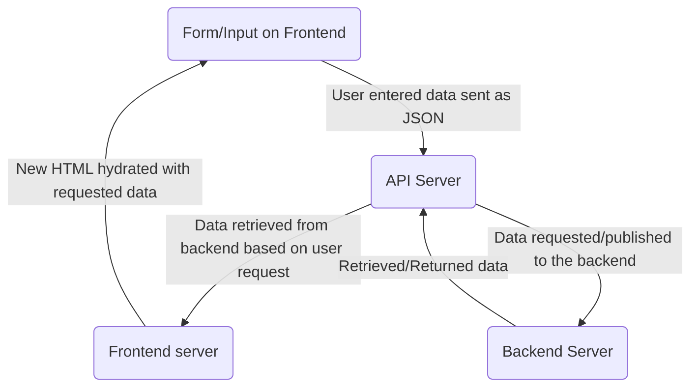
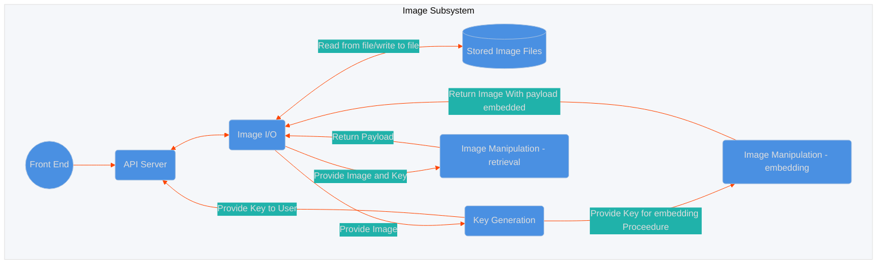
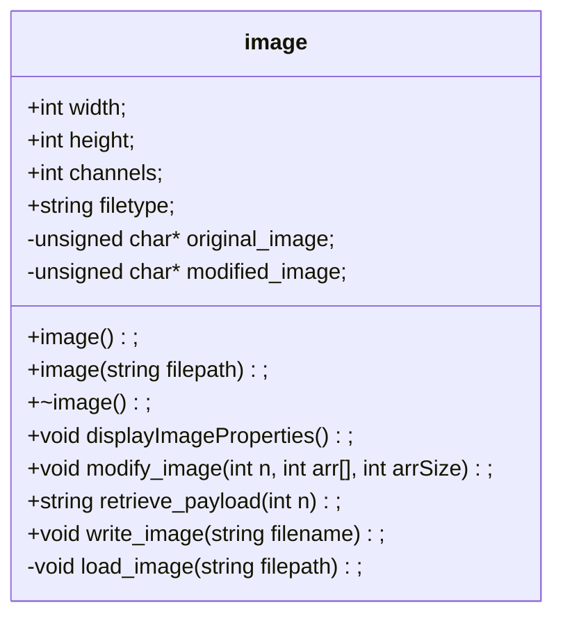
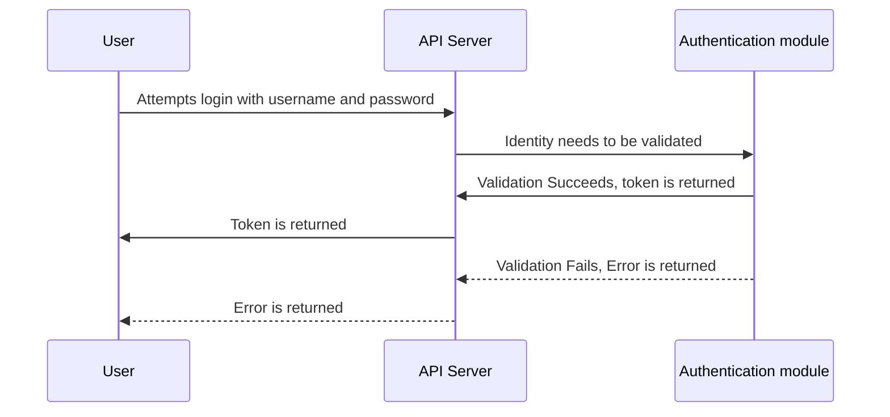
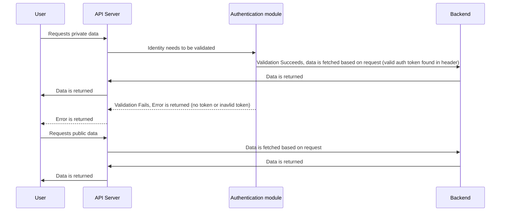
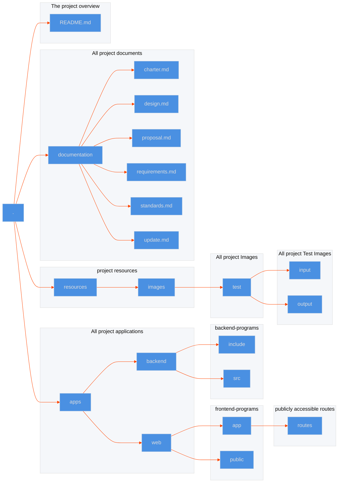

# CSCI 265 Logical Design (Phase 3)

## Team name: Project HiddenFrame

## Project/product name: HiddenFrame

## Contact person and email

The following person has been designated the main contact person for questions from the reader:

- Patrick Candy candy.pat@gmail.com

Alternate contact person:

- Jeremy Shumuk admin@payrollinsights.ca

# Table of Contents

1.  [Known Omissions](#1-known-omissions)
2.  [Design Overview](#2-design-overview)
3.  [Logical Design](#3-logical-design)
4.  [Front-End Design](#4-front-end-design)
    - 4.1. [Front-End Configuration](#42-font-end-configuration)
    - 4.2. [Public Aspect](#41-public-aspect)
    - 4.3. [Private Aspect](#42-private-aspect)
    - 4.3.1. [Image Wall](#431-image-wall)
5.  [Back-End Design](#5-back-end-design)
    - 5.1. [Image I/O](#51-image-i/o)
    - 5.2. [Key Generation](#52-key-generation)
    - 5.3. [Payload Embedding/Retrieval](#53-payload-embedding/retrieval)
6.  [Network Design](#6-network-design)
7.  [User Account Design](#7-user-account-design)
8.  [Other Design Elements](#8-other-design-elements)
    - 8.1. [Project Directory Structure](#81-project-directory-structure)
9.  [Glossary](#9-glossary)
10. [Appendixes](#10-appendixes)

# List of Figures

## 1. Known Omissions
No sections currently discuss user account creation process
## 2. Design Overview
The following is a Top Level Data Flow Diagram that describes the overall design of HiddenFrame

## 3. Logical Design 
HiddenFrame will require several components to function correctly. The main overall components are:

1. User Environment module
2. User Account module
3. Network module
4. Imaging module
Notably the User Environment module and Imaging module will be required to handle different input steams for different types of users. A further decomposition of each of these modules is provided in their own sections.
Below is a sequence diagram describing the anticipated flow of data for HiddenFrame (note: Network Module is excluded as it primarily acts as a relay/facilitator of all of these transactions).

## 4. Front-End Design

The front-end of HiddenFrame will be responsible for providing a user-friendly interface for both public and private users.
### 4.1 Front-End Configuration

- Node and NPM: For developement we are using node.js and node package manager, since our framework Remix is built on the Web fetch API we will not need to use node.js in production.
- Typescript: TypeScript is used to ensure strict type-checking and cleaner code, especially when handling sensitive functionality like steganographic embedding and decryption.
- Remix: We are using Remix as our frontend framework. Remix is a brand new framework that optimizes performance, simplifies full-stack React development, and efficiently manages data with built-in support for modern web standards and tools. It helps us to focus on the user interface and work back through web standards to create a fast and stable user experience.
- Vite: Vite is the default build tool for Remix, providing fast development server capabilities and optimized builds, which are important for maintaining the security of the private communication features.
- TailwindCSS: TailwindCSS is being in our project to build responsive layouts for the image grid and other UI elements. We have customized the config file to add our brand colors.
- ESLint: We are using ESLint to enforce clean coding practices to maintain a consistent and error-free codebase for the public-facing UI.

### 4.2 Page load and Data fetching

Since we are using [Remix](https://remix.run/) we are using server side rendering by default. This means on page load our users are sent pre rendered HTML which makes the whole experience blaing fast. All data fetching is done on the frontend server instead of the client

We will use the [fetch API](https://developer.mozilla.org/en-US/docs/Web/API/Fetch_API) to fetch data from the backend. To fetch data from the backend the frontend will make requests to our API server made with crow (see section [5. Network Design](#5-network-design))
We won't be doing any specific caching, only the caching inbuilt in Remix (which is very minimal)

Below is a minimal diagram describing the page load cycle:

### 4.3 Data input lifecycle

Whenever data needs to be fetched based on any user input (forms, image upload, etc) the user request is first formatted in JSON and then a request is made to the API server. The API server then checks for authentication if required and once all data is validated it retrieves/publishes the requested data to the backend. Once that is done any data the backend returns is forwarded through the API server to the frontend server which then hydrates the HTML with new data and sends it off to the client.

### 4.4. Public Aspect

The public-facing part of the website serves as a picture-sharing platform, allowing users to upload and browse images. This aspect is crucial to attracting a broad user base and providing the platform's visual appeal.

- Main Features:
  - Image Wall: A grid of publicly shared images that scrolls infinitely.
  - Image Upload: A button at the top allows users to upload images to the platform. These images will appear on the public wall after uploading.
  - User Interactions(stretch goal): Users can like, comment on, and share images.
- User Experience:
  - The image wall is designed for ease of use, with images displayed in a 3x3 grid format. Hover effects and clickable icons provide an intuitive interaction model for public users.
  - Responsive Design: The public aspect will be optimized for desktop, with some mobile functionality being a stretch goal.

### 4.5. Private Aspect

The private side of HiddenFrame is accessible only to privileged users who have login credentials. This aspect enables secure communication through hidden messages embedded in images using steganography.

- Main Features:

  - Private Login Page: A dedicated login page for users with access to the hidden messaging system.
  - Secret Message Board: After logging in, users can upload images with hidden messages and decode messages from received images.
  - Invite System: Privileged users can invite others to access the private aspect, creating a controlled environment for hidden communication.

- Security and Privacy:
  - Login Protection: The private login page will be built with security in mind, using HTTPS and appropriate authentication measures.

#### 4.6 Image Wall

Image Wall is a grid of publicly shared images that scrolls infinitely.

- The images are shown in descending order based on time of creation. This ensures everyone sees the same images at one time.
- The image wall uses CSS grid classes to ensure responsivness.
- The image data is fetched from the back-end API server on page load using the Web Fetch API.
- Each image is a 16 REM by 16 REM square with 0.5 REM rounded corners.
- Each image is encapsulated in the anchor tag with an href to the image's URL, which, once clicked, opens the image in a new tab.

#### 4.7 Image Upload

- The image upload is a HTML input element with the type "file" so it opens up the file selection UI
- Once a file is selected it sends the file to the backend using the Web Fetch API

## 5. Back-End Design

The back end of HiddenFrame will have to deal with 4 general requests from the front end system.

1.  Public/Private Aspect user Requests Image Storage (no steganography req)
2.  Private Aspect user requests Image Storage (Steganography req)
3.  Public/Private Aspect user requests an stored image that has no payload or has a key that does not match.
4.  Private Aspect user requests an stored image with a payload and has the key
    Overview of back end design modules and data flow is as follows

### 5.1. Image I/O
The Image I/O module will be responsible for handling any requests to store or retrieve images from the server's file system. In order to perform these operations HiddenFrame will utilize two small prebuilt libraries of C functions: stb_image.h and stb_image_write.h. Using these two libraries We will be able to read and write images to file. 
Since the manipulation of images is a key component of HiddenFrame's functionality, for ease of manipulation we will create a class called "image." The Image class will contain methods for all other components of the Image subsystem. The following is a class definition for HiddenFrame's Image class.

There are two methods in "image" which are used in image I/O and they will lean heavily on two prebuilt libraries, the stb_image.h and stb_image_write to achieve functionality. These libraries greatly simplify the process of reading and writing images to file, allowing our project to focus on the steganographic process.

### 5.2. Key Generation

The purpose of a key is to tell the encoding algorithm where to write the hidden message the sender has provided into an image and to say to the receiver where in the image to look for a hidden message. To generate a key, the following details about the image must be passed to the algorithm as functional input:

1. The number of channels in the image representing which RGBA channels are being used;
2. The $(x,y)$ dimensions of pixels of the image; and
3. The binary string to be encoded into the image.

The message will be broken down into packets of bits that will be passed through the LSBs (Least Significant Bits) of a pixel's channel(s). For an image using one or two channels, one bit of information will be passed per channel per pixel that has been instructed to be encoded or decoded by the key. For three and four-channel images, the channel being utilized will tell the encoder and decoder additional information further described in Payload Embedding and Payload Retrieval. Modifying the LSBs in the pixel channels will ensure that minimal visual changes to the images are made. The key instruct the encoder and decoder how many pixels need to be skipped within the image when looking for the next significant pixel containing information.  To perform this task, we will use generators of a group of integers $mod \\, n$.

Suppose an image has $n$ pixels. We want to know, which integers under addition $mod \\; n$ generate the set $\\{0,1,2,3,...,n-1\\}$.

Definition: Let $\\{0,1,2,3,...,n-1\\}$ be a group under the binary option of addition $mod \\; n$. We say that $a \in G$ generates $G$ if $G=\\{ a^n:n \in \mathbb{Z}\\}$. Note in this context $a^n$ does not mean $a$ to the power of $n$, but rather $a$ added to itself $n$-times, since the binary operation was addition.

To calculate the generators of $n$, we will iteratively use the Euclidean Algorithm to determine which numbers in the set $\\{0,1, 2, 3, ... , n-1\\}$ are relatively prime to $n$ up to a fixed value $k < n$ if $n$ becomes large. The purpose of going up to only a fixed value $k$, is so that our jumps between pixels do not become so large that we need to pass over unnecessarily large portions of the image with each pixel selection. To find numbers that are relatively prime to $n$, we must find integers, $i$, whose $gcd(n,i)=1$.

Next, we will look for a skip size in pixels that accomplishes two competing goals:

1. Allows us to use every pixel in the image if needed should the message become too large; and
2. Maximize the space between pixels containing information to avoid clustering of modified pixels when this can be avoided.

Using any generator as the size of skips between pixels already accomplishes our first goal.  Even if we pass over the image multiple times, we will only land on every pixel exactly once until we return to the starting position of pixel 0, the first pixel in the image. Once we have come back to this position, no further modifications to the image can be made. Utilizing generators will prevent us from colliding with previously modified pixels should we need to pass over the image more than once and will prevent us from wasting any space in the image that could include data.

To maximize the space between pixels, we need to know how many pixels must be modified in the image to maximize the space between them. This involves knowing what the bit string contents of our message will be after the characters have been converted to binary. As will be discussed in further detail in Payload Embedding and Payload Retrieval, the channels will be used to encode the bit strings into the images. The binary will be shortened into a format resembling $[2,1,3,0,1,1,...]$ that is to be read as two 1's, three 0's, one 1, ... and looks like 110001... in binary. The size of this array divided by 2 will tell us how many pixels must be modified. Using this information, we must look through our list of generators such that the total number of pixels in our image, n, divided by the number of pixels we need to modify should be roughly equal to the generator we choose from our computed list. This will ensure as even of a distribution as possible.  When this is not possible, generators $1$, and $n-1$ should NOT be chosen as they are guaranteed to cause clustering. By this method, suppose we call the generator we've selected $g$.

Now, we need to pass the following information in the key to the encoder and decoder:

1. The size of the skips which was the generator $g$ chosen;
2. The number of hex characters used to describe the generator in the key since we would want to obscure this number; and
3. The number of channels used in the image.

We can further obscure the generator $g$ we chose by randomly selecting another generator from our list since any of these numbers can be used to produce any number in $\\{0,1,2,3,...,n-1\\}$, let's call this other generator $a$. Next, we find its multiplicative inverse $a^\{-1\}$ such that $aa^\{-1\} \\; mod \\; n=1$, and finding a number $b$ such that $ab \\; mod \\; n = g$.  We can achieve this by using $a^\{-1\}$ since we can rearrange our equation $b=a^\{-1\}g \\; mod \\; n$. We can repeat this step and find multiple ways of representing $g$.  The purpose of this would be to put several $ab$ pairs into a key and provide us with a way to represent unique keys where the same generator $g$ has been chosen for different images.  Finally, our keys will have a format:

$$\\{a_1,b_1,a_2,b_2,...G,e,f\\}$$ 

where,

1. Each ab pairs are hex values that when multiplied together $mod \\; n$ give back the size of the skips between pixels containing encoded information;
2. $G$ a terminating character to tell the reader the description of the skips have ceased;
3. $e$ a hex character that describes how many hex digits each $a_i$ or $b_i$ is; and
4. $f$ the number of channels used in the image.

### 5.3. Payload Embedding/Retrieval

#### Embedding:

After a suitable key is generated for the target image, we then need to encode the payload. To employ this we will utilize the "image" class's modify_image method to perform the embedding procedure. Beforehand we convert the payload to a binary string, and then into a specialized array; the odd entries of this array represent the number of contiguous symbols in the subsequent array entry (which will be a 1 or 0). The maximum number that the odd entries can contain is the number of channels in the image eg: for a 3 channel image {3,1,2,0,3,1,1,0} would represent the binary string 111001110. We then perform bitwise operations on the LSB of each pixel's character. To encode a series of 3 ones we set the LSB of the 3rd channel (blue) to a 1 and the other two channels LSB's to a 0. Conversely if we wish to encode 3 0's we would set the 3rd channel's LSB to a 0, and the other two channels LSB's to a 1. The following example would encode a binary 11:

We utilize the generated key to provide separation between the pixels we encode and since we only modify the shade of the pixel very slightly it does not appear out of place when the image is viewed.

It is important to note here that we cannot store images as the .JPG file type, as this type of image file is lossy; the use of compression eradicates the subtle changes made to the image and render the payload irretrievable.

### Retrieval:

Here we utilize the "Image" class's retrieve_payload method. This portion works very similar to the embedding process in reverse; we utilize the provided key to visit pixels that are encoded, retrieve the binary values concatenating a string that we return as the binary of the original payload.

## 6. Network Design
Since our system is written in C++ in its back-end and uses a Javascript framework in its front-end, our front-end to back-end communication will be utilizing an API server made using ["Crow"](https://crowcpp.org/) which is a C++ framework for creating HTTP or websocket Web services. It will be useful for our system for its built-in JSON support and to make back-end to front-end communication seamless. 

We will be implementing Crow in the back-end and defining routes to handle HTTP GET and POST requests for sending and receiving data to and from the front-end.

GET requests to:

- Retrieve private message from the Secret Chat Page
  - Response: A JSON object containing the private messages.
- Retreive number of remining allowed invites for current privileged user.
  - Response: A JSON object containing the remaining invite count.
- Retrieve error messages for situations like: invalid credentials, invalid image format, exceeding allowable length(1024 UTF-8 characters) for a hidden message, etc. 
  - Response: A JSON object containing the error message.
- Retrieve system generated keys that decode the embedded images.
  - Response: A JSON object containing the keys for the embedded images.
- Retrieve embedded images with a hidden message.
  - Response: An image file or url.  
- Retrieve decoded image embedded image after key has been recognized(stretch goal).
  - Response: An image file or url.
- Retrieve decoded embedded image after key has been recognized.
  - Response: An image file or url.
- Retreive the amount of likes on a specific image(stretch goal).
  - Response: A JSON object containing the like count of the specific image.
- Retrieve image embedded image(stretch goal).
  - Response: An image file or url.

POST requests for:

- Receiving user inputted infromation for the sign up page(email and password).
  - Response: A JSON object confirming success or failure.
- Receiving user inputted credentials for the login page(email and password).
  - Response: A JSON object confirming success or failure.
- Receiving user uploaded images to be uploaded to the image board and/or images to be embedded with a hidden message.
  - Response: A JSON object confirming that the image was uploaded successfully or returning an error if the upload failed.
- Receiving user inputted hidden message to be embedded in the image.
  - Response: A JSON object confirming that the hidden message was successfully embedded in the image or returning an error if the process failed.
- Receiving user inputted private messages being sent through the Secret Chat page.
  - Response: A JSON object confirming the private message has been sent or if the process had failed.
- Receiving the action of the user liking an image(stretch goal).
  - Response: A JSON object confirming the "like" has been received or if an error occured.
- Receiving user uploaded images to be embeded as an image(stretch goal).
  - Response: A JSON object confirming that the image was uploaded successfully or returning an error if the upload failed.

Our front-end utilizes the "Remix" framework where we will leverage the web "fetch API" to handle fetching data from both the client side and the server side.  

Since our system is written in C++ in its back-end and uses a Javascript framework in its front-end, our front-end to back-end communication will be utilizing an API server made using ["Crow"](https://crowcpp.org/) which is a C++ framework for creating HTTP or websocket Web services. It will be useful for our system for its built-in JSON support and to make back-end to front-end communication seamless.

We will be implementing Crow in the back-end and defining routes to handle HTTP GET and POST requests for sending and receiving data to and from the front-end.

### 6.1 Authentication

Our API server will also run authentication on privilaged routes. We will be using JWT Token authentication for the same.

Represented below is basic authentication flow assuming the user is already registred:

Represented below is the basic flow for accessing API routes both privilaged and non privilaged:

### 6.2 Routes

GET requests to:

#### Retrieve private messages on the Secret Chat Page

 
<code>GET</code> <code><b>/messages</b></code> <code>Get all messages sent to user</code>

##### Headers

| name          | type     | data type                 | description |
| ------------- | -------- | ------------------------- | ----------- |
| Authorization | required | string (containing token) | N/A         |

##### Responses

| http code | content-type       | response                                              |
| --------- | ------------------ | ----------------------------------------------------- |
| `200`     | `application/json` | `{"success": true, "messages": [TBD MESSAGE OBJECT]}` |
| `401`     | `application/json` | `{"success": false, "error":"Unauthorized"}`          |

 
<code>GET</code> <code><b>/message/:id</b></code> <code>Retrieve a specific message sent to user</code>

##### Headers

| name          | type     | data type                 | description |
| ------------- | -------- | ------------------------- | ----------- |
| Authorization | required | string (containing token) | N/A         |

##### Responses

| http code | content-type       | response                                           |
| --------- | ------------------ | -------------------------------------------------- |
| `200`     | `application/json` | `{"success": true, "message": TBD MESSAGE OBJECT}` |
| `401`     | `application/json` | `{"success": false, "error":"Unauthorized"}`       |

#### Retreive number of remining allowed invites for current privileged user

 
<code>GET</code> <code><b>/user/invites</b></code>

##### Headers

| name          | type     | data type                 | description |
| ------------- | -------- | ------------------------- | ----------- |
| Authorization | required | string (containing token) | N/A         |

##### Responses

| http code | content-type       | response                                     |
| --------- | ------------------ | -------------------------------------------- |
| `200`     | `application/json` | `{"success": true, "invites": number}`       |
| `401`     | `application/json` | `{"success": false, "error":"Unauthorized"}` |

#### Retreive image wall images

 
<code>GET</code> <code><b>/images</b></code> <code>Get first 100 images</code>

##### Headers

| name          | type     | data type                 | description                                           |
| ------------- | -------- | ------------------------- | ----------------------------------------------------- |
| Authorization | optional | string (containing token) | If token provided and valid, keys will be in response |

##### Responses

| http code | content-type       | response                                                                  |
| --------- | ------------------ | ------------------------------------------------------------------------- |
| `200`     | `application/json` | `{"success": true, "images": string[] \| {"url": string, "key": string}}` |
| `401`     | `application/json` | `{"success": false, "error":"Unauthorized"}`                              |

- Retrieve error messages for situations like: invalid credentials, invalid image format, exceeding allowable length(1024 UTF-8 characters) for a hidden message, etc.
  - Response: A JSON object containing the error message.
- Retrieve system generated keys that decode the embedded images.
  - Response: A JSON object containing the keys for the embedded images.
- Retrieve embedded images with a hidden message.
  - Response: An image file or url.
- Retrieve decoded image embedded image after key has been recognized(stretch goal).
  - Response: An image file or url.
- Retrieve decoded embedded image after key has been recognized.
  - Response: An image file or url.
- Retreive the amount of likes on a specific image(stretch goal).
  - Response: A JSON object containing the like count of the specific image.
- Retrieve image embedded image(stretch goal).
  - Response: An image file or url.

POST requests for:

#### Receiving user inputted infromation for the sign up page (email and password).

 
<code>POST</code> <code><b>/user/register</b></code> <code>Resister a new user</code>

##### Request Body

| name     | type     | data type | description                                                          |
| -------- | -------- | --------- | -------------------------------------------------------------------- |
| inviteId | required | string    | A valid invite Id generated by an existing user needs to be provided |
| username | required | string    | User's requested username                                            |
| password | required | string    | Hashed password                                                      |

##### Responses

| http code | content-type       | response                                                                                                                           | description                    |
| --------- | ------------------ | ---------------------------------------------------------------------------------------------------------------------------------- | ------------------------------ |
| `200`     | `application/json` | `{"success": true, "user": { "username": string, "token": { "id": string, "exp": number: "createdAt": number, "token": string } }` | If valid invite was provided   |
| `401`     | `application/json` | `{"success": false, "error":"Unauthorized"}`                                                                                       | If invalid invite was provided |

#### User login using username and password

 
<code>POST</code> <code><b>/user/login</b></code> <code>Login existing user</code>

##### Request Body

| name     | type     | data type | description               |
| -------- | -------- | --------- | ------------------------- |
| username | required | string    | User's requested username |
| password | required | string    | Hashed password           |

##### Responses

| http code | content-type       | response                                                                                                                           | description                          |
| --------- | ------------------ | ---------------------------------------------------------------------------------------------------------------------------------- | ------------------------------------ |
| `200`     | `application/json` | `{"success": true, "user": { "username": string, "token": { "id": string, "exp": number: "createdAt": number, "token": string } }` | If username and password match       |
| `401`     | `application/json` | `{"success": false, "error":"Unauthorized"}`                                                                                       | If username and passwords dont match |

- Receiving user inputted credentials for the login page(email and password).
  - Response: A JSON object confirming success or failure.
- Receiving user uploaded images to be uploaded to the image board and/or images to be embedded with a hidden message.
  - Response: A JSON object confirming that the image was uploaded successfully or returning an error if the upload failed.
- Receiving user inputted hidden message to be embedded in the image.
  - Response: A JSON object confirming that the hidden message was successfully embedded in the image or returning an error if the process failed.
- Receiving user inputted private messages being sent through the Secret Chat page.
  - Response: A JSON object confirming the private message has been sent or if the process had failed.
- Receiving the action of the user liking an image(stretch goal).
  - Response: A JSON object confirming the "like" has been received or if an error occured.
- Receiving user uploaded images to be embeded as an image(stretch goal).
  - Response: A JSON object confirming that the image was uploaded successfully or returning an error if the upload failed.

Our front-end utilizes the "Remix" framework where we will leverage the web "fetch API" to handle fetching data from both the client side and the server side.

## 7. User Account Design
We will utilize a database to store user account information and hashed passwords. This will be a very simple subsystem it is only required to respond to a few types of system requests. When a user attempts to login, username and passwords will be passed through the frontend via our API server to the database. The database will then query it's entries and check if the provided password matches then username. The database will then return the result to the API Server. 

The API server will be responsible for ensuring that users requesting access to resources are only able to access resources for which they have permissions. This will likely be implemented by a token exchange. 
## 8. Other Design Elements

### 8.1 Project Directory Structure

A few guidelines for Project HiddenFrame's Directory structure are laid out in the standards document. Beyond what is listed there we will utilize the following structure (note documentation is included in the FS but no other files are):

## 9. Glossary

**LSB** - Least significant bit
**DFD** - Data Flow Diagram

## 10. Appendixes
