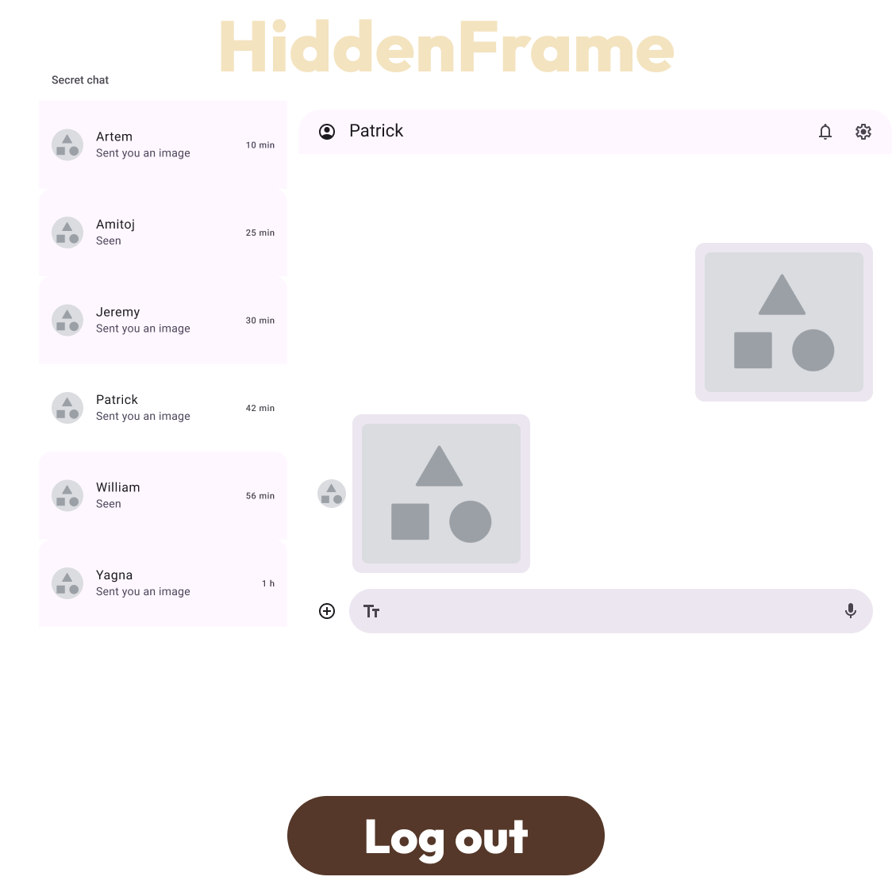

# CSCI 265 Requirements and specifications (Phase 2)

## Team name: Project HiddenFrame

## Project/product name: HiddenFrame

## Contact person and email

The following person has been designated the main contact person for questions from the reader:

 - NameA, their@emailaddy

 # Table of Contents
 1. [Introduction and overview](#section1)
 2. [Known issues/omissions](#section2)
 3. [Product features and behavior](#section3)
 4. [User interface and navigation](#section4)
 5. [Use cases/scenarios](#section5)
 6. [Non-functional requirements](#section6)
    - 6.1. [Public  Aspect](#section61)
    - 6.2. [Private Aspect](#section62)
    - 6.3. [Mathematics](#section63)
 1. [Feature prioritization](#section7)
 2. [Glossary](#section8)
 3. [Appendices](#section9)

## 1.Introduction and overview 

Provide the reader with an introduction to the product: its purpose, its core features, what audience it is aimed at and how they'll be using it, and what platform(s) it is targeting.

Project HiddenFrame is, in brief, a picture board (like Pinterest) that will use various technologies like DBMS, WebRTC, and APIs. It also acts as a secret message board by using steganography. HiddenFrame will be publicly accessible and encourage the general public to share photographic content; meanwhile, select users will be using HiddenFrame's true capabilities to exchange pictures encoded with hidden data. (Which only a select few will know about)

It targets the Web platform with a focus on desktop devices first and mobile devices as a strech goal.

If the product has limitations that the user wouldn't expect then those should be mentioned as well.  (For example, if we were building a calculator but it couldn't handle real number calculations then we should probably warn the reader about that.)

## 2.Known issues/omissions 

Currently HiddenFrame will allow uploading images with embedding hidden text messages in the same images.
Our strech goals include:

- Uploading images with secret embedded audio
- Uploading images with secret embedded images
- Uploading videos with secret embedded text
- Uploading videos with secret embedded audio
- Uploading vidoes with secret embedded images

## 3.Product features and behaviour 

This might be much like our original proposal but in far greater detail: we want to thoroughly explain/describe all aspects of the product's functionality: all the features and every aspect of its behaviour.

Here the reader should should be able to find the answer for any question along the lines of
- How do I use feature X?
- How do I enter data value Y?
- What are the limits (if any) on what I enter for Z?
- What does the product do if I enter an incorrect value?
- What happens when I select W?"

This section should be intuitive to follow if the reader is simply reading through the document to learn about the product, but it should also make it easy for the reader to quickly look up the answer to any specific question.

## 4.User interface and navigation 

The images shown for the interfaces, screens, and menus are not intended to be taken as exact literal images of the final version of the website, rather they reflect the required on-screen elements for each component, and the approximate visual appearance and location for each.

Navigation Guide/Map

1. Main Page (Feed and Upload):
	- Users can upload new images via the “Upload” button or browse through the grid of previously uploaded images. Clicking on an image in the grid will open a larger view of the image.
2. URL → Log in Page:
    - Users can go to the log in page using their URL.
3. Log in Page → Conversation Board:
	- After successfully logging in, users can access the conversation board to send secret messages. They can select a user from the list on the left and exchange images with embedded data.
4. Conversation Board (Secret Chat):
	- In the conversation board, users can view exchanged images and send new images or messages using the interface.

1. Main Page (Upload and Feed View)

This is the primary screen users see after opening our website. It serves as the hub for uploading and browsing images.

Elements:

- HiddenFrame logo.
- Upload Button: A button at the center of the page, allowing users to add images.
- Image Grid: A grid layout below the upload button where previously uploaded images appear. Each image in the grid has:
	- Like Icon: Allows users to like the image.
	- Share Icon: Enables users to share the image.
	- Comment Icon: Allows users to comment on the image, likely opening a comment thread.

Navigation Flow:

- Click Upload: This takes the user to a file selection interface for image uploads.
- Click on Image in Grid: Opens a larger view of the image.

2. Login Page

Before accessing the main interface, users must log in. The only way to get to the "log in" screen is through the URL. This screen presents a simple and user-friendly login process.

Elements:

- HiddenFrame logo.
- Falling images: random, already uploaded by users, falling images.
- Login Form: Contains two fields:
	- Email Field with placeholder "Your email".
	- Password Field with placeholder "Your password".
- Login Button: A large button labeled “Log in” at the bottom, which submits the form.

Navigation Flow:

- Submit Login Details: Successful login takes the user to the Main Page.

3. Conversation Board Page(Secret Chat)

This is the communication hub for users to exchange images encoded with hidden messages using steganography.

Elements:

- HiddenFrame logo.
- User List (Left Panel): Displays a list of users the current user has interacted with. Each list item includes:
	- Profile Icon and Name: Displays the other user’s profile picture and name.
	- Message Status: Text like “Sent you an image” or “Seen” reflects the message exchange status.
	- Time Indicator: Shows how long ago each interaction occurred (e.g., “10 min ago”).
- Message Area (Right Panel): Displays the conversation between the user and the selected contact. Elements include:
	- Sent Images: Thumbnail images representing the conversation.
	- Text Field: Below the message area, allowing users to send messages (which will be encoded into picture, once sent) or share images .
	- Send Button: A button at the bottom of the text field to send images.

Navigation Flow:

- Select a User: Clicking a user from the list loads the conversation with that user.
- Send Image/Text: Users can send images by selecting the image or typing into the text field.

## 5.Use cases/scenarios 

Provide use cases detailing the different ways someone might actually want to use the product (e.g. a "sign in" use case, a "check balance" use case, a "make a deposit" use case, etc).

Provide scenarios that illustrate the use cases in a practical example.  (E.g. Bob has $30 to deposit and wants to deposit it, check the balance, and if there is enough then transfer $100 to his savings account, ... then walk through the Bob's actions from sign-in to sign-out.)

## 6.Non-functional requirements 
### 6.1. Public  Aspect 
One of the central pillars of project HiddenFrame is it's social media. HiddenFrame shares many of the non-functional requirements as other social media platforms. Some of the primary concerns of the Public Aspect are:
- User Privacy - HiddenFrame's public site is intended to attract a userbase posting publicly visible photographs. As such we will require a comprehensive disclaimer, permitting the public display of all photos posted to the site. Since, the public site will not (at this time) require account creation no (or minimal) user data will be stored.  
- Data use and Retention - HiddenFrame will have to comply with federal and provincial data protection laws such as the federal [Personal Information Protection and Electronic Documents Act](https://laws-lois.justice.gc.ca/PDF/P-8.6.pdf) and the BC [Personal Information Protection Act](https://www.bclaws.gov.bc.ca/civix/document/id/complete/statreg/03063_01).  
- Moderation - With the anonymous nature of the posts on the public site, it is extremely important that HiddenFrame moderate content to ensure that the pictures on the site are appropriate. 
- Hardware & Networking - Images have a relatively large storage requirement; managing server space in order to accommodate demand may be a challenge. The uploading and downloading of images can also take a significant amount of time; as such a fast internet connection for the server will be required. (The amount of storage space and network speed required will need to be quantified on a per user basis.)
- Image retention period - The permanent storage of images in bulk is unlikely to be viable. As such ProjectHidden frame will only retain images for a set period of time before deletion (exact amount of time TBC).
### 6.2. Private Aspect 
HiddenFrame's other primary feature is the steganography manipulation of images for chosen users. In addition to all of the Public Aspect Non-functional Requirements this part of the project poses its own unique challenges:
- User Privacy - Since this part of the site will require account creation HiddenFrame will have a responsibility to safeguard any user information provided. 
- Steganography keys -  If the decryption keys for image decoding are stored on the HiddenFrame servers (not ideal), they will be secured in order to ensure security.
- Misuse of HiddenFrame for Illegal activity - HiddenFrame will moderate the site for content and co-operate with law enforcement in whatever capacity is required. 
### 6.3. Mathematics 
HiddenFrame's steganographic features require that we develop a method inserting the payload into the carrier, and successfully retrieve the payload back from the carrier. As such we will require The ability to produce 'keys' which will mathematically describe the pixels modified. In order to accomplish this we will utilize the mathematical concept of a "generating set". This concept will allow us to describe the pixels we will be using for steganography.

## 7.Feature prioritization 

Much like the scaling section in the original proposal, here we must document which features are regarded as essential, which ones are secondary priorities, and which ones are 'nice to have' but low priority for this term.

## 8.Glossary 

Define any product-specific terms and any terms that are unlikely to be known to the 'average' reader (e.g. a random second-year CS student).

## 9.Appendices 

If additional supported documents are needed then append them here

