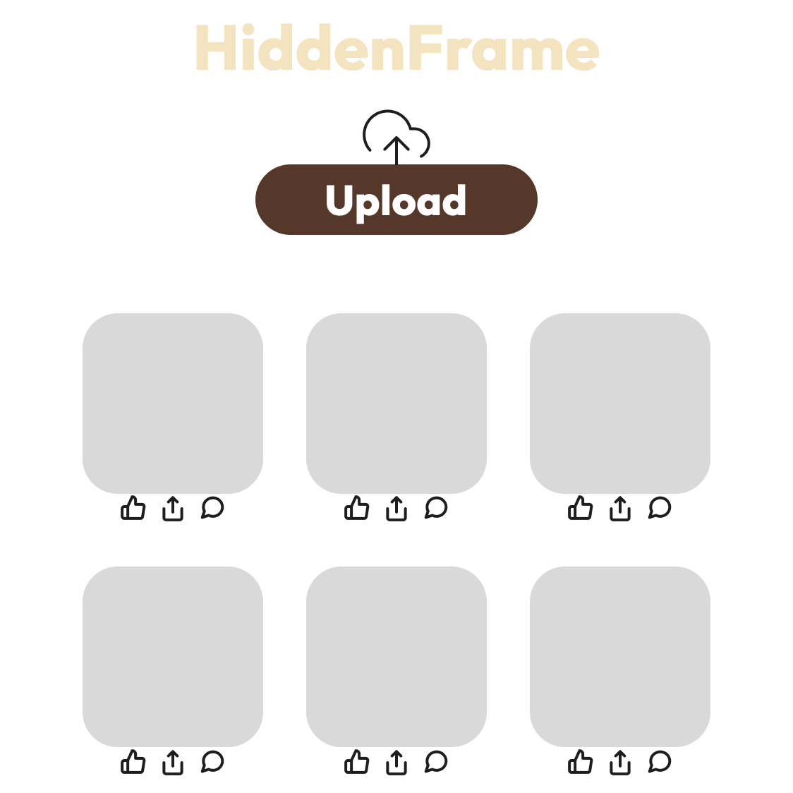
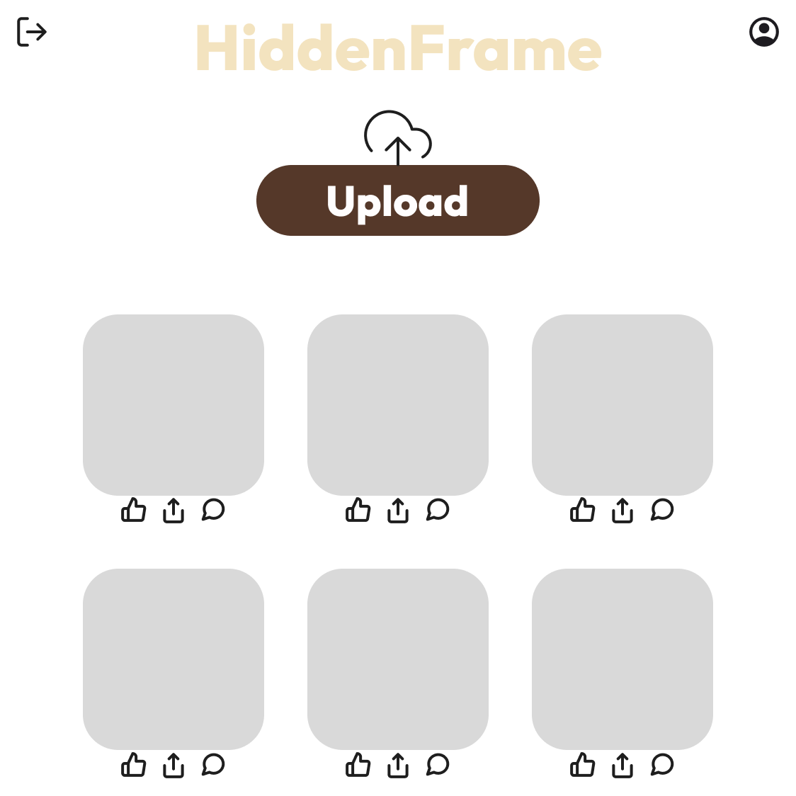

# CSCI 265 Requirements and specifications (Phase 2)

## Team name: Project HiddenFrame

## Project/product name: HiddenFrame

## Contact person and email

The following person has been designated the main contact person for questions from the reader:

 - Artem Trefilov artlov59@gmail.com

Alternate contact person:

 - Yagna Patel yagna111204@gmail.com

 # Table of Contents
 1. [Introduction and overview](#1-introduction-and-overview)
 2. [Known issues/omissions](#2-known-issuesomissions)
 3. [Product features and behavior](#3-product-features-and-behaviour)
	 - 3.1. [Image wall](#31-image-wall)
	 - 3.2. [Uploading images](#32-uploading-images)
	 - 3.3. [Private login](#33-private-login)
	 - 3.4. [Hiding messages in the pictures](#34-hiding-messages-in-the-pictures)
	 - 3.5. [Creating invites](#35-creating-invites)
 4. [User interface and navigation](#4-user-interface-and-navigation)
	 - 4.1. [Main Page](#41-main-page)
	 - 4.2. [Login Page](#42-login-page)
	 - 4.3. [Conversation Board Page](#43-conversation-board-page)
5. [Use cases/scenarios](#5-use-casesscenarios)
	 - 5.1. [Use Cases](#51-use-cases)
	   - 5.1.1. [General Users](#511-general-users)
	   - 5.1.2. [Privileged Users](#512-privileged-users)
	 - 5.2. [Scenarios](#52-scenarios)
	   - 5.2.1. [Uploading a Photo Scenario](#521-uploading-a-photo-scenario)
	   - 5.2.2. [Sending a Secret Message with an Embedded Image Scenario](#522-sending-a-secret-message-with-an-embedded-image-scenario)
	   - 5.2.3. [Viewing a Hidden Message Scenario](#523-viewing-a-hidden-message-scenario)
 6. [Non-functional requirements](#6-non-functional-requirements)
    - 6.1. [Public Aspect](#61-public--aspect)
    - 6.2. [Private Aspect](#62-private-aspect)
    - 6.3. [Mathematics](#63-mathematics)
 7. [Feature prioritization](#7-feature-prioritization)
    - 7.1. [Primary Features](#71-primary-features)
    - 7.2. [Secondary Features](#72-secondary-features)
    - 7.3.  [Stretch Goals](#73-stretch-goals)
 8. [Glossary](#8-glossary)
 9. [Appendices](#9-appendices)

# List of Figures

- A. [Main Page](#41-main-page)
- B. [Login Page](#42-login-page)
- C. [Conversation Board Page](#43-conversation-board-page)

## 1. Introduction and overview

HiddenFrame is a unique platform that can be defined as a public picture-sharing board with hidden communication possibilities. The project is built around the idea of creating an otherwise innocent and visually appealing platform where people can share their pictures. From the user's perspective, HiddenFrame is no different from such websites as Pinterest. Users can browse pictures posted by other people and also share their own media. The public nature of the project intends to encourage as many people as possible to participate and share their content. However, beneath this seemingly ordinary exterior lies a sophisticated system for obfuscated communication. This system relies on steganographic techniques to embed a message within shared images. This design makes HiddenFrame a dual-purpose system, where a relatively busy public platform serves as a cover for a covert communication medium.

Technical Implementation:
- Robust Database Management System (DBMS) for efficient data storage and retrieval
- WebRTC integration for real-time communication and potential peer-to-peer functionality
- API integrations to enhance platform features and connectivity

The unique way that HiddenFrame obfuscates hidden messages opens up a wide range of possible applications:
- Journalism: HiddenFrame provides a secure channel for communicating with those providing vital sources and information to the world’s newspapers, ensuring that that both the whistleblower and their mission stay protected and secretive.
- Law enforcement: HiddenFrame may also provides a channel for communication with undercover agents and secret informants, ensuring their anonymity while still being able to deliver vital information.
- Penetration testing: One can also use HiddenFrame to simulate the use of a steganographic hidden channel between a theoretical enemy and a real law enforcement agency. This way, the ability to detect the misuse of an image-based steganographic channel in a real-life scenario can be tested and evaluated.

Project HiddenFrame will launch on desktop first but is intended for the web platform that provides best experience and features for users on large screens. This makes it possible to incorporate advanced features and a richer user experience, both of which can be difficult on mobile. The desktop-first approach focuses on building for the power and screen real estate, especially to help people share and engage around photographic products so users get what looks/feels like a continuous and consistent experience.

## 2. Known issues/omissions

Currently HiddenFrame will allow uploading images with embedding hidden text messages in the same images.

Our strech goals include:

- Uploading images with secret embedded audio; and
- Uploading images with secret embedded images

Other known omissions are:

- the amount of required storage and network capacity on a per-user basis;
- the length of time an image will be retained on the site;
- the file size limit and/or max resolution of images that may be uploaded;
- storage location of steganographic 'keys'; 
- how many invites a user can send to others to join the secret user's list; and
- whether we will use a private user's username or email address as identifying information.

## 3. Product features and behaviour

### 3.1. Image wall

As mentioned earlier, HiddenFrame is, in brief, a picture board (like Pinterest). It will be publicly accessible and encourages the general public to share photographic content. 

This photographic content will be visible on the home page of our web app on our "Image wall," which is basically a 3x3 grid of images that "infinitely" scrolls. Having it be responsive will be one of our stretch goals.

### 3.2. Uploading images

Our web-based app will allow users to upload any images they want to our servers, which will then be displayed on our home page image wall. 

This feature will be accessible as a button on our home page right above the image wall.

The public aspect users will have some sort of image upload size limit (TBD).

### 3.3. Private login

Select users will be using HiddenFrame's true capabilities to exchange pictures embedded with hidden data.

Our web app will have a private login page that will allow this capability. Users will be able to find this page at the `/login` endpoint (subject to change).

This web page will have a simple login form that will ask the user for some sort of identifier (username/email, TBD) and a password (using passkeys is a stretch goal).

### 3.4. Hiding messages in the pictures

The same web-based app will also have a special upload section for private users, which will include a text box that allows users to type in a message that will get embedded into their image using steganography. Once the image is embedded, we will provide the user with a "key" that can be used to decrypt the message from the image later. 

The text message will be limited to 1024 UTF-8 characters in an image of not less than 40,000 pixels.

The registered users will be able to access this page after logging in from the aforementioned private login page.

### 3.5. Creating invites

The private web page will also have a button that allows them to create a set number of invites. These invites will allow the receivers to create an account for the private aspect.

Once a registered user has created the allocated number of invites, they cannot create any more invites.

The registered users will be able to access this page after logging in from the aforementioned private login page.

## 4. User interface and navigation

The images shown for the interfaces, screens, and menus are not intended to be taken as exact literal images of the final version of the website; rather, they reflect the required on-screen elements for each component and the approximate visual appearance and location for each.

Navigation Guide/Map

1. Main Page (Feed and Upload):
	- Users can upload new images via the “Upload” button or browse through the grid of previously uploaded images. Clicking on an image in the grid will open a larger view of the image.
2. URL → Log in Page:
    - Users can go to the login page using their URL.
3. Log in Page → Conversation Board:
	- After successfully logging in, users can access the conversation board to send secret messages. They can select a user from the list on the left and exchange images with embedded data.
4. Conversation Board (Secret Chat):
	- In the conversation board, users can view exchanged images and send new images or messages using the interface.

### 4.1. Main Page

This is the primary screen users see after opening our website. It serves as the hub for uploading and browsing images.

Elements:

- HiddenFrame logo.
- Upload Button: A button at the center of the page, allowing users to add images.
- Image Grid: A grid layout below the upload button where previously uploaded images appear. Each image in the grid has:
	- Like Icon: Allows users to like the image.
	- Share Icon: Enables users to share the image.
	- Comment Icon: Allows users to comment on the image, likely opening a comment thread.

Navigation Flow:

- Click Upload: This takes the user to a file selection interface for image uploads.
- Click on Image in Grid: Opens a larger view of the image.

### 4.2. Login Page

Before accessing the main interface, users must log in. The only way to get to the "log in" screen is through the URL. This screen presents a simple and user-friendly login process.

Elements:

- HiddenFrame logo.
- Falling images: random, already uploaded by users, falling images.
- Login Form: Contains two fields:
    - Email Field with the placeholder "Your userID."
    - Password Field with the placeholder "Your password."
- Login Button: A large button labelled "Login" at the bottom, which submits the form.

Navigation Flow:

- Submit Login Details: Successful login takes the user to the Main Page.

### 4.3 Conversation Board Page 

This is the communication hub for users to exchange images encoded with hidden messages using steganography.

Elements:

- HiddenFrame logo.
- Log out Button: Logs user out.
- Profile Button: Allows you to change the password.
- Upload Button: A button at the center of the page, allowing users to add images.
- Image Grid: A grid layout below the upload button where previously uploaded images appear. Each image in the grid has:
	- Like Icon: Allows users to like the image.
	- Share Icon: Enables users to share the image.
	- Comment Icon: Allows users to comment on the image, likely opening a comment thread.

Navigation Flow:

- Click Upload: This takes the user to a file selection interface for image uploads.
- Click on Image in Grid: Opens a larger view of the image with the hidden message.
- Click Log out: Logs out of an account.
- Click Profile: Opens a page, where a user can thange their password.

## 5. Use cases/scenarios

### 5.1. Use Cases 
Considering that HiddenFrame is both a public picture sharing website but also a discrete way to share messages. The use cases may vary between the two distinct user groups: General Users & Privieleged Users.

### 5.1.1. General Users 
- Upload Photo Use Case - The user uploads a photo to the website prompting the user to leave a title for the photo being uploaded.
- View Image Use Case - The user can enlarge an image by clicking on it.
- Like Use Case - The user can choose to like photos they are currently viewing by clicking on the thumbs up icon.
- Comment Use Case - The user can choose to comment on photos they are currently viewing by clicking the speech bubble icon.
- Share Use Case - The user can share photos by clicking on the "Share" icon.

### 5.1.2. Privileged Users 
These users share the same use cases with general users. Although, they have a few extra use cases exclusive to them:
- Sign up Use Case - The user must create an account to be able to access the Secret Message page.
- Log in Use Case - The user must log in in order to upload photos as well as interact with photos that have been uploaded by entering their specific credentials using the designated log in URL.
- Embed Hidden Message in Photo Use Case - Privileged users have the option to embed a hidden message in the photo to be uploaded in the upload photo page.
- Sending a Photo to be embedded with a Hidden Message Use Case - Privileged users have the option to send the photo with an embedded message in the Secret Message page. This will generate a key for the user to share with other privileged users. Whether keys are entered by the user or having the server know which keys the user has is something that is currently being discussed and ironed out by the team.
- Secret Message Use Case - Privileged users have the option to send secret messages through the Secret Message page available to them. They can send each other private messages as well as photos and embedded photos that can be decoded with the specific keys.
- Decode Hidden Message from Image Use Case - Privileged users have the option to decode the hidden message by clicking on the "Decode Hidden Message" button on the page of the pgoto they are viewing. Whether they are prompted to enter a key or having the server recognize that this user has the key is currently being discussed and ironed out by the team.

### 5.2. Scenarios 

### 5.2.1. Uploading a Photo Scenario 
Jeremy, a general user without an account, wants to upload a photo of his cute dog sleeping.

In order to do this, these are the actions Jeremy must proceed with:
- Jeremy enters HiddenFrame's URL in his preferred browser.
- Jeremy clicks the "Upload Photo" button.
- Jeremy gets redirected to the upload photo page of the website and is prompted to upload a photo in a supported format.
- He can click on the "Upload" button to upload his photo.

### 5.2.2. Sending a Secret Message with an Embedded Image Scenario
Artem, a privileged user with an account, would like to send a photo containing a hidden message to HiddenFrame's website to tell Patrick where there are available parking spaces at VIU.

In order to do this, these are the actions Artem must proceed with:
- Artem enters HiddenFrame's login URL in his preferred browser.
- Artem enters the specific credentials that he uses to access HiddenFrame's website with his extra privileges.
- Once signed in, Artem gets redirected to HiddenFrame's Secret Message page.
- Artem looks for Patrick's name on the Secret Message page's sidebar and clicks it.
- Artem clicks the "Upload" button.
- Artem attaches the photo he would like to use. If he chooses not to, A.I. will generate a random image.
- Artem types the hidden message in a text field designated for the hidden message.
- Artem clicks on the "Embed Image" button.
- Once the image has been embedded a key is generated that he can share with Patrick.
- Artem copies the key to send to Patrick.
- Artem clicks send.

### 5.2.3. Viewing a Hidden Message Scenario 
Patrick, a privileged user with an account signed in to HiddenFrame, wants to view the embedded message that Artem uploaded to find the available parking space.

In order to do this, these are the actions Patrick must proceed with:
- Patrick enters HiddenFrame's URL in his preferred browser.
- Patrick navigates to the Secret Message page.
- Patrick clicks Artem's name on the sidebar to view their chat.
- Patrick sees the image and clicks it.
- Patrick enters the key Artem sent him in a text field and clicks the "View Hidden Message" button.
- Patrick receives a pop-up on his browser containing a hidden message about the parking space's location.

## 6. Non-functional requirements

### 6.1. Public  Aspect

One of the central pillars of Project HiddenFrame is its social media. HiddenFrame shares many of the non-functional requirements as other social media platforms. Some of the primary concerns of the Public Aspect are:
- User Privacy - HiddenFrame's public site is intended to attract a user base by posting publicly visible photographs. As such, we will require a comprehensive disclaimer permitting the public display of all photos posted on the site. Since the public site will not (at this time) require account creation, no (or minimal) user data will be stored.  
- Data use and Retention - HiddenFrame will have to comply with federal and provincial data protection laws, such as the federal [Personal Information Protection and Electronic Documents Act](https://laws-lois.justice.gc.ca/PDF/P-8.6.pdf) and the BC [Personal Information Protection Act](https://www.bclaws.gov.bc.ca/civix/document/id/complete/statreg/03063_01).  
- Moderation - With the anonymous nature of the posts on the public site, it is extremely important that HiddenFrame moderate content to ensure that the pictures on the site are appropriate. 
- Hardware & Networking - Images have a relatively large storage requirement; managing server space in order to accommodate demand may be a challenge. The uploading and downloading of images can also take a significant amount of time; as such, a fast internet connection for the server will be required. (The amount of storage space and network speed required will need to be quantified on a per-user basis.)
- Image retention period - The permanent storage of images in bulk is unlikely to be viable. As such, Project HiddenFrame will only retain images for a set period of time before deletion (exact amount of time TBD).

### 6.2. Private Aspect

HiddenFrame's other primary feature is the steganography manipulation of images for chosen users. In addition to all of the Public Aspect Non-functional Requirements, this part of the project poses its own unique challenges:
- User Privacy - Since this part of the site will require account creation HiddenFrame will have a responsibility to safeguard any user information provided. 
- Steganography keys -  If the decryption keys for image decoding are stored on the HiddenFrame servers (not ideal), they will be secured in order to ensure security.
- Misuse of HiddenFrame for Illegal activity - HiddenFrame will moderate the site for content and cooperate with law enforcement in whatever capacity is required. 

### 6.3. Mathematics

HiddenFrame's steganographic features require that we develop a method for inserting the payload into the carrier and successfully retrieving the payload back from the carrier. As such, we will require the ability to produce 'keys' that will mathematically describe the pixels modified. To accomplish this, we will utilize the algebraic concept of group generators under a binary operation mod N.

Definition of a group: Let $A$ be a set together with a binary operation (we will be using addition) that assigns to each ordered pair $(a,b)$ of elements of $A$ and element of $A$ denoted $ab$. We say that $A$ is a group under this operation if the following three axioms are satisfied.

1. Associativity. The operation is associative; that is, $(ab)c = a(bc)$ for all $a,b,c \in A.$
2. Identity. There is an element $e$ (called the identity) in $G$ such that $ae=ea=a \\; \forall \\; a \in A.$
3. Inverses exist. For each element $a \in A$, there is a unique element $b \in A$ (called the inverse of $a$ and denoted $a^{-1}$) such that $ab=ba=e.$

Definition of a cyclic group and a generator: Let $A$ be a group. We say that $A$ is cyclic if there exists an element $a \in A$ such that $A=\\{a^n:n\in\mathbb{Z}\\}$ and that $a$ is a generator of $A$. Note, that in this case, $a^n$ does not mean $a$ to the power of $n$, but rather $a$ composed with itself $n$ times under the binary operation of the group $A$.

Any set of integers under addtion $\\{0,1,2,...,n-1\\} \\; modulo \\; n$ denoted $\mathbb{Z}_n$ satisfies the definition of a cyclic group. This means that leveraging concepts from group theory and modular arithmetic will work for selecting pixels for modification in an image, regardless of the dimensions of an image provided by the user, where $n$ is the total number of pixels in an image. However, practical computing constraints to image size and message size will need to be considered. To generate the group when performing pixel selection, we may use any generator of the set $\\{0,1,2,...,n-1\\}$.

To find generators of $n$ we may us the Euclidean Algorithm, that is given $n,x \in \mathbb{Z}$ where $x<n$:

$$n=qx + r \\; : \\; q,r \in mathbb{Z}, 0 \leq r < x$$.

If $r=0$, then $gcd(n,x)=x$ otherwise, $gcd(n,x)=gcd(x,r)$. We perform these steps iteratively until $r=0$. If in our final iteration of testing the $gcd$ for two integers, the lesser integer being tested was equal to $1$, then $x$ was a generator of $n$. If $gcd(n,x)>1$, then $x$ is NOT a generator of $n$.

## 7. Feature prioritization

For some of our team members, this is our first attempt at building a website. For all of our team members, this is our first attempt to create a piece of technology using steganography techniques. The following lists include primary features, secondary features, and stretch goals for the scope of our project.

### 7.1. Primary Features

The features our team considers mandatory for our project are:
- A webpage for creating a username for select users with access to the secret chat feature;
- A webpage for logging into a username for select users with access to the secret chat feature;
- A webpage for uploading and posting pictures to a public picture-board sharing site;
- A secret webpage for uploading an image (carrier) with a hidden message (payload) that includes a hidden message embedded within the image to send to another user. Initially, the payload will be limited to text. This webpage should also indicate if a user has received any unread secret messages, allow them to read them, and display the image they were embedded within;
- A wall/picture-board sharing webpage to view pictures the user and other users have posted;
- A program running on the server that can be called by the webpage that encodes payloads into carriers and decodes them for the recipient. Initially, this program should be able to encode text into an image using a key system where the key is embedded into the file's data;
- A key generation algorithm that fits a key into a filename of not more than 50 characters; 
- An encoding algorithm that fits not less than 1024 UTF-8 characters into an image containing at least 40,000 pixels; and
- An invite webpage where select users with access to the secret chat feature may invite others to create a username and utilize the hidden feature(s).

### 7.2. Secondary Features

Our secondary goals that our team hopes to implement depending on the remaining time available for the creation of this project include:
- A username recovery mechanism;
- One-time read/receive secret messages by removing the decode key from the file's contents; and
- A separate payload type of chiptune music tones that may be encoded into images with not less than 150,000 pixels.

### 7.3. Stretch Goals

Our team's stretch goals include that are not expected to make it into our project submission but would be nice to include if all previous items are completed ahead of schedule:
- Using a separate carrier format for both secret text messages and music files;
- The ability to like and comment on pictures on the wall;
- Adding support for embedding images as payloads; and
- Utilizing a common encryption standard into the process so that secret messages are encrypted into and decrypted from their payloads in addition to being embedded into the file.

## 8. Glossary 
**Steganography**: The art or practice of concealing a message, image, or file within another message, image, or file

**Public Aspect**: The portion of HiddenFrame that is accessible by the general public.

**Private Aspect**: The portion of HiddenFrame that is accessible by invitation only. Allows the use of Steganography features.

**Carrier**: A file, image, of message used to hide another message, image or file in steganography.

**Payload**: A file, image, of message hidden inside another message, image or file in steganography.

**TBD**: To be decided

## 9. Appendices

